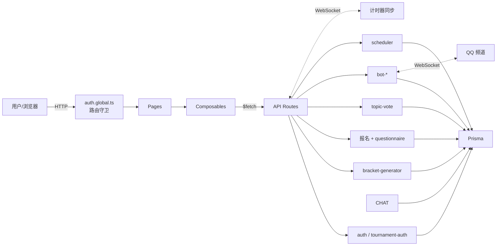
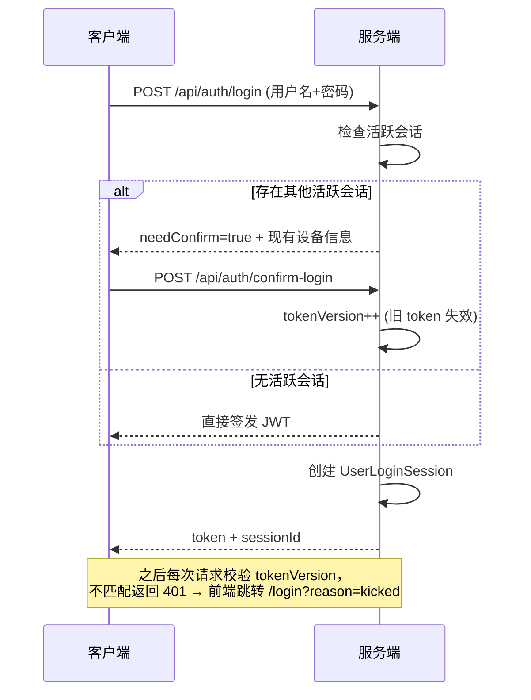
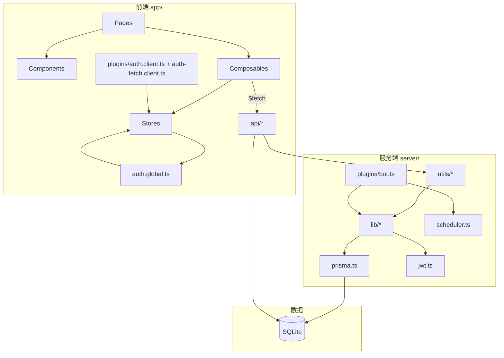
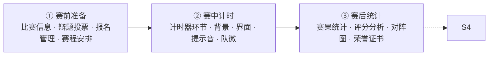

# DebateTimer V3 — Code Wiki（结构化技术文档）

> 辩论赛计时与评分管理系统 · 全栈技术参考
> 文档版本：V4.1（全模块覆盖版） · 生成日期：2026-07-23
> 面向新成员：阅读本文可在 30 分钟内建立项目全局认知，并定位任一模块的代码入口。

---

## 目录

1. [项目概述](#1-项目概述)
2. [项目整体架构](#2-项目整体架构)
3. [主要模块职责](#3-主要模块职责)
4. [关键类与函数说明](#4-关键类与函数说明)
5. [依赖关系](#5-依赖关系)
6. [项目运行方式](#6-项目运行方式)
7. [附录：API 速览与工程约定](#7-附录api-速览与工程约定)

---

## 1. 项目概述

### 1.1 定位
DebateTimer V3 是一套基于 **Nuxt 4 + Vue 3 + TypeScript + Prisma + SQLite** 的全栈辩论赛计时评分系统。它把「赛事管理 → 赛中计时 → 赛后统计 → 实时互动」的完整生命周期搬到同一套 Web 应用中，并额外集成 QQ 频道 Bot、报名系统、辩题投票、定时发布、荣誉证书等扩展能力。

### 1.2 核心功能一览

| 能力域 | 关键特性 | 入口模块 |
|--------|----------|----------|
| 赛事管理 | 6 种赛制（单败/双败/循环/佩寄/瑞士/小组+淘汰）、手动/自动生成赛程、积分榜、软删除+恢复 | [bracket-generator.ts](file:///d:/Code/DebateTimer/DebateTimerV3/server/utils/bracket-generator.ts)、[schedule.vue](file:///d:/Code/DebateTimer/DebateTimerV3/app/pages/tournaments/[id]/schedule.vue) |
| 实时计时 | 单/双计时器、时间戳锚定防漂移、WebSocket 多端同步、离线版导出 | [debate.ts](file:///d:/Code/DebateTimer/DebateTimerV3/app/stores/debate.ts)、[TimerPreview.vue](file:///d:/Code/DebateTimer/DebateTimerV3/app/components/TimerPreview.vue) |
| QQ Bot | 频道内身份认领、赛场管理、赛程/排名播报、权限控制、指数退避重连 | [bot-*.ts](file:///d:/Code/DebateTimer/DebateTimerV3/server/lib) |
| 报名系统 | 个人/队伍报名、免登录公开报名、自定义字段、自动组队、辩手子账号 | [useRegistration.ts](file:///d:/Code/DebateTimer/DebateTimerV3/app/composables/useRegistration.ts) |
| 辩题投票 | 赛事级/场次级投票、多种投票者类型、IP+UA 指纹防刷 | [topic-vote.ts](file:///d:/Code/DebateTimer/DebateTimerV3/server/utils/topic-vote.ts) |
| 辩题库管理 | 正反方立场结构化存储、分类标签、候选辩题与场次辩题联动 | [DebateTopic](file:///d:/Code/DebateTimer/DebateTimerV3/prisma/schema.prisma#L313-L326)、[DebateTopicPicker.vue](file:///d:/Code/DebateTimer/DebateTimerV3/app/components/DebateTopicPicker.vue) |
| 通用问卷 | 12 种题型、拖拽式表单设计器、报名/投票/评分统一存储 | [questionnaire.ts](file:///d:/Code/DebateTimer/DebateTimerV3/server/utils/questionnaire.ts)、[FormDesigner.vue](file:///d:/Code/DebateTimer/DebateTimerV3/app/components/FormDesigner.vue) |
| 定时发布 | 单次/每日/每周调度、QQ 论坛发帖、时区安全、执行历史 | [scheduler.ts](file:///d:/Code/DebateTimer/DebateTimerV3/server/lib/scheduler.ts) |
| 荣誉证书 | 多模板、所见即所导、PNG/PDF 导出、自动填充赛事数据 | [certificate/](file:///d:/Code/DebateTimer/DebateTimerV3/app/components/certificate)、[useCertificate.ts](file:///d:/Code/DebateTimer/DebateTimerV3/app/composables/useCertificate.ts) |
| 权限体系 | system_admin / admin / subaccount / debater / individual 五级、单设备登录 | [auth.ts](file:///d:/Code/DebateTimer/DebateTimerV3/server/utils/auth.ts)、[tournament-auth.ts](file:///d:/Code/DebateTimer/DebateTimerV3/server/utils/tournament-auth.ts) |

---

## 2. 项目整体架构

### 2.1 分层架构

系统采用经典的前后端一体（Nuxt 全栈）分层：表现层 = Vue 页面/组件；业务层 = Nitro 服务端 API；持久层 = Prisma + SQLite。QQ Bot 通过独立 WebSocket 通道与业务层交互。

```mermaid
flowchart TB
  subgraph UI["表现层 · 用户界面 (Vue 3 / Nuxt 4)"]
    direction LR
    P["Pages 页面<br/>(约定式路由)"] --> C["Components 组件"]
    C --> CP["Composables 组合式函数"]
    CP --> S["Pinia Stores 状态<br/>(auth / debate)"]
  end

  subgraph BIZ["业务层 · 服务端 (Nitro / Nuxt Server)"]
    direction LR
    API["API Routes<br/>(server/api)"] --> U["Utils 工具函数"]
    U --> L["Lib 核心库<br/>(prisma / jwt / bot / scheduler)"]
  end

  subgraph DATA["持久层"]
    PR["Prisma ORM<br/>(@prisma/adapter-libsql)"] --> DB[("SQLite 数据库")]
  end

  subgraph BOT["QQ Bot 通道"]
    BWS["bot-ws.ts<br/>(WebSocket 网关)"] --> API
  end

  end

  UI -->|"HTTP / WebSocket"| BIZ
  BIZ --> PR
  CP -->|"$fetch"| API
```

### 2.2 技术选型概览

| 层级 | 技术 | 版本 | 说明 |
|------|------|------|------|
| 前端框架 | Nuxt / Vue | 4.4.8 / 3.5.35 | 约定式路由、SSR/SSG、自动导入 |
| UI 组件库 | Nuxt UI（基于 Tailwind CSS） | v4.8.2 | 原子化样式 + 组件库（reka-ui 底层） |
| 状态管理 | Pinia | 3.0.4 | 客户端全局状态（auth / debate） |
| 路由 | Vue Router | 5.1.0 | 随 Nuxt 约定式路由自动生成 |
| 图标 | @iconify-json/lucide | 1.2.x | Lucide 图标集（`i-lucide-*`） |
| 服务端 | Nitro（Nuxt Server） | 内置 | API Routes、OpenAPI、WebSocket |
| ORM | Prisma | 7.8.0 | Schema 在 `prisma/schema.prisma`，生成到 `server/lib/generated` |
| 数据库 | SQLite（libsql 适配器） | — | 通过 `@libsql/client` + `@prisma/adapter-libsql` 访问 |
| 认证 | JWT + bcryptjs | 9.0.3 / 3.0.3 | `jsonwebtoken` 签发，`bcryptjs` 校验密码 |
| 实时通信 | WebSocket（ws 库） | 8.21.0 | QQ Bot 网关 |
| 文档生成 | docx | 9.7.1 | 导出 Word 版报名/对阵等材料 |
| 图像导出 | html-to-image | 1.11.13 | 证书 PNG 导出（动态 import） |
| 拖拽 | vue-draggable-plus | 0.6.1 | 问卷设计器、环节排序 |

### 2.3 目录结构

```
DebateTimerV3/
├── app/                         # 前端应用（Nuxt 约定式路由根目录）
│   ├── layouts/                 # 布局：default / tournament / standalone
│   ├── pages/                   # 页面路由（文件即路由）
│   │   ├── tournaments/[id]/    # 团队赛事子页面（info/schedule/timing/result/certificate/...）
│   │   ├── standalone/[id]/     # 独立赛事子页面
│   │   ├── timer/               # 计时器项目
│   │   ├── bot/                 # Bot 管理
│   │   ├── teams/               # 团队管理
│   │   ├── home.vue / login.vue / settings.vue / index.vue
│   ├── components/              # 通用组件
│   │   ├── certificate/         # 证书组件（Canvas / Editor / Paper）
│   │   └── public/              # 公开页头部/页脚
│   ├── composables/             # 组合式函数（11 个）
│   ├── stores/                  # Pinia 状态（auth / chat / debate）
│   ├── middleware/              # 路由守卫（auth.global.ts）
│   ├── plugins/                 # 客户端插件（auth 初始化、fetch 拦截器）
│   ├── data/                    # 静态数据（cities / debate-templates）
│   ├── utils/                   # 前端工具（stageType / speakerSide / certificateTemplates）
│   └── assets/css/              # 全局样式（main.css，含 CSS 变量主题）
├── server/                      # 后端服务（Nitro）
│   ├── api/                     # REST API 路由（按资源分目录）
│   │   ├── auth/ admin/ bot/ matches/ scheduled-posts/
│   │   ├── standalone-matches/ team/ teams/ timer/ tournaments/
│   │   ├── internal/            # 内部接口（外部自动化调用）
│   │   └── upload.post.ts       # 文件上传
│   ├── lib/                     # 核心库
│   │   ├── prisma.ts jwt.ts scheduler.ts
│   │   ├── bot-*.ts             # Bot 模块（9 个文件）
│   │   └── generated/           # Prisma 生成客户端
│   ├── utils/                   # 工具函数（13 个）
│   ├── db/seed.ts               # 种子脚本
│   └── plugins/bot.ts           # 服务端插件（Bot 启动 + 调度器）
├── prisma/                      # Prisma Schema + 本地数据库文件
├── public/                      # 静态资源
│   ├── fonts/                   # WOFF2 字体（阿里巴巴普惠体 / 数字字体）
│   ├── uploads/                 # 用户上传文件
│   └── *.mp3                    # 计时器提示音（30s/5s/End）
├── docs/                        # 设计文档（certificate-spec / diagnosis-timing-schema / scheduled-publishing-architecture）
├── nuxt.config.ts               # Nuxt 全局配置（构建/缓存/路由规则）
├── prisma.config.ts             # Prisma 配置
├── package.json                 # 依赖与脚本
├── CODE_WIKI.md                 # 本文档
├── DEPLOYMENT.md                # 部署说明
├── ROUTES.md                    # 路由清单
└── README.md                    # 项目说明
```

---

## 3. 主要模块职责

### 3.1 模块总览

| 模块 | 代码位置 | 功能边界 | 主要依赖 |
|------|----------|----------|----------|
| 权限认证 | [auth.ts](file:///d:/Code/DebateTimer/DebateTimerV3/server/utils/auth.ts)、[tournament-auth.ts](file:///d:/Code/DebateTimer/DebateTimerV3/server/utils/tournament-auth.ts)、[jwt.ts](file:///d:/Code/DebateTimer/DebateTimerV3/server/lib/jwt.ts) | JWT 签发校验、角色判定、单设备登录、赛事读写分离、服务令牌 | prisma、bcryptjs、jsonwebtoken |
| 赛事与赛程 | [bracket-generator.ts](file:///d:/Code/DebateTimer/DebateTimerV3/server/utils/bracket-generator.ts)、[tournaments/](file:///d:/Code/DebateTimer/DebateTimerV3/server/api/tournaments) | 赛事 CRUD、6 赛制生成、晋级联动、抽签、积分榜 | prisma、auth |
| QQ Bot | [bot-*.ts](file:///d:/Code/DebateTimer/DebateTimerV3/server/lib)、[bot/](file:///d:/Code/DebateTimer/DebateTimerV3/server/api/bot) | WebSocket 连接、消息处理、身份/权限、赛场管理、播报、评分 | ws、prisma、http |
| 计时器引擎 | [debate.ts](file:///d:/Code/DebateTimer/DebateTimerV3/app/stores/debate.ts)、[TimerDisplay.vue](file:///d:/Code/DebateTimer/DebateTimerV3/app/components/TimerDisplay.vue)、[TimerConfig.vue](file:///d:/Code/DebateTimer/DebateTimerV3/app/components/TimerConfig.vue) | 单/双计时器状态机、时间戳锚定防漂移、实时预览、环节切换 | Pinia、WebSocket |
| 报名系统 | [useRegistration.ts](file:///d:/Code/DebateTimer/DebateTimerV3/app/composables/useRegistration.ts)、[tournaments/[id]/registrations](file:///d:/Code/DebateTimer/DebateTimerV3/server/api/tournaments/[id]) | 报名提交/审核、自定义字段、自动组队、子账号 | questionnaire、auth |
| 通用问卷 | [questionnaire.ts](file:///d:/Code/DebateTimer/DebateTimerV3/server/utils/questionnaire.ts)、[FormDesigner.vue](file:///d:/Code/DebateTimer/DebateTimerV3/app/components/FormDesigner.vue) | 报名/投票/评分统一题目引擎（12 题型）、拖拽设计器 | prisma |
| 辩题投票 | [topic-vote.ts](file:///d:/Code/DebateTimer/DebateTimerV3/server/utils/topic-vote.ts)、[topic-votes](file:///d:/Code/DebateTimer/DebateTimerV3/server/api/tournaments/[id]/topic-votes) | 候选辩题投票、统计、防刷 | prisma、questionnaire |
| 定时发布 | [scheduler.ts](file:///d:/Code/DebateTimer/DebateTimerV3/server/lib/scheduler.ts)、[scheduled-posts/](file:///d:/Code/DebateTimer/DebateTimerV3/server/api/scheduled-posts) | 单次/每日/每周调度、QQ 论坛发帖、时区安全 | prisma、bot-ws |
| 荣誉证书 | [certificate/](file:///d:/Code/DebateTimer/DebateTimerV3/app/components/certificate)、[useCertificate.ts](file:///d:/Code/DebateTimer/DebateTimerV3/app/composables/useCertificate.ts) | 多模板证书编辑、所见即所导、PNG/PDF 导出 | html-to-image |
| 前端导航 | [layouts/*](file:///d:/Code/DebateTimer/DebateTimerV3/app/layouts)、[auth.global.ts](file:///d:/Code/DebateTimer/DebateTimerV3/app/middleware/auth.global.ts) | 侧边栏、赛事四阶段流程导航、路由守卫 | stores/auth |

### 3.2 模块交互关系



### 3.3 逐模块说明

#### 3.3.1 权限认证模块
- **职责边界**：所有身份/权限判定逻辑收敛于此，API 层不重复实现。
- **核心能力**：从请求头解 JWT、校验单设备登录（`tokenVersion`）、四层鉴权（用户会话/服务令牌/内部 API Key/匿名公开）、赛事级读写分离、`requireRole` / `requireServiceToken` 守卫。
- **与其他模块交互**：`tournament-auth.ts` 依赖 `auth.ts` 与 `prisma`；业务 API 通过 `requireReadTournament` / `requireWriteTournament` 复用；WorkBuddy 等外部自动化通过 `requireServiceToken`（团队 `apiToken`）调用。

#### 3.3.2 赛事与赛程模块
- **职责边界**：赛制算法与赛事数据生命周期，不直接处理 UI。
- **核心能力**：6 种赛制生成、种子保护、BYE 识别、胜者晋级溯源（`promotedFromA/B`）、乐观锁并发、瑞士轮动态重配对、小组晋级、抽签（分组/辩题/正反方）、积分榜计算。
- **与其他模块交互**：生成/晋级结果写入 `Match`；结果提交触发 `advanceWinnerToNextRound`；积分榜由 `computeStandings` 实时计算；瑞士轮整轮结束后 `autoPairNextSwissRound` 重配；小组赛结束后 `autoPromoteFromGroupsToKnockout` 填入淘汰赛。

#### 3.3.3 QQ Bot 模块
- **职责边界**：与 QQ 频道网关的实时交互，独立于核心业务。
- **核心能力**：WebSocket 连接管理（心跳/指数退避重连/熔断）、三层消息去重、公私域 intents 隔离、多团队错峰启动、赛场管理、消息命令分发、身份认领、环节权限控制、计分与播报。
- **与其他模块交互**：通过 HTTP API 读写 `BotArena` / `BotArenaClaim` / `BotArenaRole` / `BotPermissionLog` 表；调用 `bot-data-sync` 同步赛程/排名到频道；调用 `bot-scoring` 处理评分；通过 `bot-notifications` 推送比赛事件。

#### 3.3.4 计时器引擎模块
- **职责边界**：纯前端状态机 + 服务端运行时状态持久化。
- **核心能力**：单/双计时器倒计时、**时间戳锚定模型**（避免后台标签页漂移）、阶段（警告/危急）提示音、环节切换、双计时器独立重置、16:9 实时预览、单一 250ms 心跳循环。
- **与其他模块交互**：`TimerDisplay` 是视觉渲染唯一来源（预览与正式页共用）；运行时状态落 `Timer` 表；通过 WebSocket 多端同步。

#### 3.3.5 报名系统模块
- **职责边界**：报名全流程 + 与问卷引擎、子账号创建的协作。
- **核心能力**：个人/队伍报名、免登录公开报名、自定义字段、审核流转、个人报名自动组队、批量生成 debater 子账号。
- **与其他模块交互**：报名字段同步到 `Questionnaire`；审核通过后 `convert-teams` 生成 `TournamentTeam`；`create-accounts` 生成 `User`（role=debater）。

#### 3.3.6 通用问卷 / 辩题投票模块
- **职责边界**：底层题目引擎 + 上层投票业务。
- **核心能力**：12 种题型、拖拽式表单设计器、题目与提交记录统一存储；辩题投票支持赛事级/场次级、多投票者类型、IP+UA 指纹防刷。

#### 3.3.8 定时发布模块
- **职责边界**：定时向 QQ 频道论坛子频道发布辩论题目/讨论帖。
- **核心能力**：单次/每日/每周调度、时区安全（`Intl.DateTimeFormat` 实现）、下次触发时间计算、执行历史记录、失败告警推送到 `botChannelId`。
- **与其他模块交互**：调用 `bot-ws.ts` 的 `postForumThread`；serverless 环境需外部 cron ping `/api/scheduled-posts/dispatch-due` 保活。

#### 3.3.9 荣誉证书模块
- **职责边界**：辩论赛荣誉证书的编辑与导出，纯前端实现。
- **核心能力**：多模板（classic/minimal/none）、所见即所导（`id="cert-paper"` 供截图）、按赛事持久化（localStorage）、自动填充赛事数据（冠军/亚军/季军/最佳辩手）、PNG 高清导出（scale=2）、PDF 打印（弹窗拦截时降级 PNG 下载）。
- **与其他模块交互**：动态 `import('html-to-image')` 避免常驻打包；导出前 `await document.fonts.ready` 保证字体加载。

---

## 4. 关键类与函数说明

### 4.1 权限认证

#### `JWTPayload`（接口，[jwt.ts](file:///d:/Code/DebateTimer/DebateTimerV3/server/lib/jwt.ts)）
| 字段 | 类型 | 说明 |
|------|------|------|
| `userId` | string | 用户 ID |
| `username` | string | 用户名 |
| `role` | string | system_admin / admin / subaccount / debater / individual |
| `mode` | string | qq_bot / individual |
| `teamId` | string? | 所属团队 |
| `tokenVersion` | number | 单设备登录版本号 |
| `sessionId` | string | 会话 ID |

#### 单设备登录流程


#### 赛事权限判定（[tournament-auth.ts](file:///d:/Code/DebateTimer/DebateTimerV3/server/utils/tournament-auth.ts)）
```typescript
// 读权限：system_admin 或 同团队的 admin/subaccount/debater
canReadTournament(user, tournament): boolean
requireReadTournament(event, prisma, tournamentId): { user, tournament }

// 写权限：system_admin 或 团队 admin（team.adminId 匹配）
canWriteTournament(user, tournament, team): boolean
requireWriteTournament(event, prisma, tournamentId): { user, tournament }
```

#### 四层鉴权守卫（[auth.ts](file:///d:/Code/DebateTimer/DebateTimerV3/server/utils/auth.ts)）
| 守卫 | 用途 | 鉴权方式 |
|------|------|----------|
| `getUserFromEventWithSession` | 用户会话校验 | JWT + `tokenVersion` 比对 |
| `requireRole(event, role)` | 角色守卫 | 上一项 + 角色断言 |
| `requireServiceToken(event)` | 服务令牌（外部自动化） | 团队 `apiToken` Bearer |
| `verifyInternalKey(event)` | 内部 API Key | `INTERNAL_API_KEY` 环境变量 |

### 4.2 赛程生成（[bracket-generator.ts](file:///d:/Code/DebateTimer/DebateTimerV3/server/utils/bracket-generator.ts)）

| 函数 | 入参 | 返回 | 业务要点 |
|------|------|------|----------|
| `generateBracket(options)` | `{ teams, format, seedMode, ... }` | `{ matches, format, totalMatches, roundCount, formatLabel }` | 6 赛制总入口 |
| `generateSingleElimination` | 队伍列表、种子方式 | `MatchInput[]` | 种子保护对阵 + BYE 补位 |
| `generateDoubleElimination` | 同上 | `MatchInput[]` | 胜者组 W- + 败者组 L- + 总决赛 |
| `generateRoundRobin` | 同上 | `MatchInput[]` | Circle Method 单/双循环 |
| `generatePagePlayoff` | 同上 | `MatchInput[]` | 佩寄制（4 队固定 R1-R4） |
| `generateSwiss` | 同上 | `MatchInput[]` | 首轮种子保护，后续留壳由赛果重配 |
| `generateGroupKnockout` | 分组数、每组晋级数 | `{ groupMatches, knockoutMatches }` | 蛇形分组 + 循环 + 淘汰 |
| `advanceWinnerToNextRound` | 赛事 ID、已结束比赛 | `AdvanceResult` | 胜者自动填入下一轮（promotedFrom 溯源） |
| `autoPairNextSwissRound` | 赛事 ID、当前轮 | `MatchInput[]` | 瑞士轮整轮结束后按积分重配 |
| `autoPromoteFromGroupsToKnockout` | 赛事 ID | `MatchInput[]` | 小组赛前 N 名填入淘汰赛 |
| `computeStandings(matches)` | 比赛列表 | `StandingsEntry[]` | 积分/胜平负/净胜分排序 |
| `runDrawLots(tournament, type)` | 赛事、抽签类型 | `DrawResult` | 综合：分组 + 辩题 + 正反方 |

**种子保护对阵算法**（`generateSeedingBracket`）：对 2 的幂队伍数，按 `(1 vs N), (2 vs N-1)...` 分布，确保强队晚相遇；`bracketSize=8 → [1,8,4,5,2,7,3,6]`。

**循环赛 Circle Method**：固定一支队伍，其余每轮旋转。例（5 队）：
```
第1轮: 1-5  2-4  3-轮空
第2轮: 1-4  5-3  2-轮空
第3轮: 1-3  4-2  5-轮空
第4轮: 1-2  3-5  4-轮空
第5轮: 1-轮空 2-5 3-4
```

### 4.3 QQ Bot（[bot-*.ts](file:///d:/Code/DebateTimer/DebateTimerV3/server/lib)）

| 接口/函数 | 文件 | 说明 |
|-----------|------|------|
| `BotConfig` / `BotInstance` | `bot-ws.ts` | Bot 配置与运行时对象（ws、status、retryCount、sendMessage 等） |
| `getBackoffMs(retryCount, rateLimited)` | `bot-ws.ts` | 指数退避：`5s→10s→20s→40s→80s→120s`（封顶），频控延长到 180s，含 0–3s 抖动 |
| `createBotInstance` / `disconnectBot` / `connectBot` | `bot-ws.ts` | 实例生命周期管理（幂等创建） |
| `loadBotsFromDatabase` / `resyncConfiguredBots` | `bot-ws.ts` | 启动加载与保活（仅拉起无实例的 Bot，不动手动断开/熔断的） |
| `callBotApi` / `postForumThread` / `renameChannel` | `bot-ws.ts` | QQ HTTP API 封装 |
| `handleMessage` | `bot-handlers.ts` | 命令分发：`ping/help/状态/设置赛场/结束比赛/认领/辩题/赛程/下一场/排名` |
| `FORMAT_ROLES` / `createArena` / `closeArena` / `claimRole` | `bot-roles.ts` | 比赛形式身份组定义（4v4/3v3/2v2）+ 赛场创建（含并发保护）+ 身份认领 |
| `setRoleChannelPermission` / `switchRoundWhitelist` / `grantAudienceSpeak` | `bot-permissions.ts` | 频道权限切换、环节白名单、观众临时发言（默认 5 分钟自动撤销） |
| `submitScore` / `updateMatchScores` / `recalculateRankings` | `bot-scoring.ts` | 评分提交 + 多评委汇总 + 排名重算（$transaction 批量） |
| `getTopicPool` / `getNextMatch` / `getSchedule` / `formatScheduleText` | `bot-data-sync.ts` | 数据查询与文本格式化 |
| `trySendNotification` | `bot-notifications.ts` | 事件通知（match_start/result、round_change、score_submitted） |
| `setBotSchedule` / `startAllBotsWithSchedule` / `getBotResourceSnapshot` | `bot-manager.ts` | 多团队错峰启动（3-5s 抖动）+ 资源监控（70%/90% 告警） |
| `BotPermissionLog` | schema | 所有权限操作可追溯审计 |

### 4.4 报名系统核心算法（[tournaments/[id]/registrations](file:///d:/Code/DebateTimer/DebateTimerV3/server/api/tournaments/[id])）

**个人报名自动组队**：按 `preferredPosition`（一辩/二辩/三辩/四辩/不限）分组 → 每组抽一人成队 → 「不限」补位 → 不足 `teamSize` 标记不完整。

**辩手子账号生成规则**：
- 用户名：`debater_{姓名}_{4位随机码}`（例 `debater_张三_myVO`）
- 密码：8 位随机字母数字
- 角色：`debater`（只读），`teamId` 关联赛事所属团队

**报名字段配置**：6 个系统字段（`submitterName/contactPhone/contactEmail/teamName/members/notes`）+ 自定义字段，通过 `RegistrationField` 表存储，由 `system-fields.ts` 维护元信息。

### 4.5 计时器引擎（[debate.ts](file:///d:/Code/DebateTimer/DebateTimerV3/app/stores/debate.ts) + [TimerDisplay.vue](file:///d:/Code/DebateTimer/DebateTimerV3/app/components/TimerDisplay.vue)）

| 组成 | 说明 |
|------|------|
| `useDebateStore`（Pinia） | 维护剩余时长、运行态、当前环节索引、正/反方双计时状态 |
| **时间戳锚定模型** | `endAt = Date.now() + 剩余秒*1000`，单一 `setInterval(runLoop, 250)` 心跳按 `remaining = max(0, round((endAt - Date.now())/1000))` 修正，避免后台标签页被节流导致漂移 |
| `fireCues(prev, remaining)` | 穿越检测：从上方向下穿过 30/5/0 秒时触发对应音效 |
| `ensureLoop` / `stopLoop` | 所有运行中环节共用一个心跳；无任何环节在计时则停循环省电 |
| `TimerDisplay` | 1280×720 设计基准画布，所有尺寸用 px；外层调用方 transform scale 缩放；渲染队名+队徽、环节名、单/双计时器 |
| `TimerBanner` | 从 `TimerDisplay` 抽出的顶部红蓝横幅组件，1280×720 基准；展示正方/反方立场标签与辩题；可独立复用为全屏横幅覆盖层 |
| `TimerPreview` | 预览专用，视觉委托 `TimerDisplay`，仅展示静态初始时长，不实际倒计时 |
| 计时阶段 | 警告（剩余 20%–10%）、危急（<10%）、提示音（30s/5s/0s） |

### 4.7 定时发布调度器（[scheduler.ts](file:///d:/Code/DebateTimer/DebateTimerV3/server/lib/scheduler.ts)）

| 函数 | 说明 |
|------|------|
| `computeNextRun(task, from)` | 计算 `once/daily/weekly` 三种调度的下次触发时间（UTC） |
| `buildForumContent(task)` | 拼接正文 + 标签 + 投票选项 |
| `triggerTask(prisma, task)` | 取团队 Bot 凭证 → `postForumThread` 发帖 → 写 `ScheduledPostRun` |
| `scanDueTasks(prisma)` | 扫描 `status=pending && nextRunAt<=now`，失败推告警到 `botChannelId` |
| `dispatchPostById(prisma, id)` | 立即发布单条（管理员触发） |
| `startScheduler` / `stopScheduler` | 启动 in-process `setInterval`（默认 30s）/ 清理 |

**时区安全**：使用原生 `Intl.DateTimeFormat` 实现，不依赖 cron 库；时间统一以 UTC 存储，展示时按 `timezone` 还原。Serverless 环境需外部 cron ping `/api/scheduled-posts/dispatch-due` 保活。

### 4.8 荣誉证书（[certificate/](file:///d:/Code/DebateTimer/DebateTimerV3/app/components/certificate) + [useCertificate.ts](file:///d:/Code/DebateTimer/DebateTimerV3/app/composables/useCertificate.ts)）

| 组件/函数 | 说明 |
|-----------|------|
| `CertificateCanvas.vue` | 画布缩放外壳，`ResizeObserver` 测量舞台尺寸，`fitScale = min(availW/baseW, availH/baseH)`，工具栏（缩放滑块/适应屏幕/实际大小） |
| `CertificateEditor.vue` | 玻璃拟态编辑面板：模板选择、画布尺寸预设、内容字段、样式控制（边框/主题/字体/印章） |
| `CertificatePaper.vue` | 证书"纸张"视觉**唯一来源**，固定设计坐标（px），字号用 `calc(var(--ck) * Npx)` 等比缩放，`id="cert-paper"` 供导出截图 |
| `useCertificate` | `reactive<CertificateConfig>` 单一数据源；按赛事持久化到 localStorage（防抖 400ms）；`fill(kind)` 自动填充冠军/亚军/季军/最佳辩手；`exportPng(scale=2)` 动态 import `html-to-image`；`printPdf()` 高清图在新窗口打印，弹窗拦截时降级 PNG 下载 |

---

## 5. 依赖关系

### 5.1 内部模块依赖图



**依赖方向原则**：`pages → composables → stores/api`；`api → utils → lib → prisma`；禁止反向依赖（前端不直接 import `server/lib`）。

### 5.2 Bot 模块内部依赖

```
plugins/bot.ts
  ├─ lib/prisma.ts
  ├─ lib/bot-ws.ts        ← (loadBotsFromDatabase, resyncConfiguredBots)
  └─ lib/scheduler.ts     ← (startScheduler, stopScheduler)

lib/bot-ws.ts
  ├─ lib/prisma.ts
  ├─ lib/bot-handlers.ts  ← (handleMessage)
  └─ 自身导出: createBotInstance / callBotApi / postForumThread / sendChannelMessage / renameChannel / ...

lib/bot-handlers.ts
  ├─ lib/bot-roles.ts     ← (createArena, closeArena, claimRole, ...)
  ├─ lib/bot-data-sync.ts ← (getTopicPool, getSchedule, getNextMatch, ...)
  └─ lib/bot-scoring.ts   ← (getRankings, formatRankingsText)

lib/bot-roles.ts → lib/bot-ws.ts (callBotApi, renameChannel)
lib/bot-permissions.ts → lib/bot-ws.ts (callBotApi) + lib/bot-roles.ts (getActiveArena)
lib/bot-notifications.ts → lib/bot-ws.ts (getBotInstance)
lib/bot-manager.ts → lib/bot-ws.ts (getAllBotInstances, getBotInstance, createBotInstance, resolveIntents)
lib/scheduler.ts → lib/bot-ws.ts (postForumThread, sendChannelMessage, BotConfig)
```

### 5.3 前端组件复用关系

```
useDropdown ← RolePicker、StageTypeCascader、SpeechRolePicker、ColorPicker
TimerBanner ← TimerDisplay ← TimerPreview ← TimerPreviewCard ← 5 个配置页面 + 正式计时页
CertificatePaper ← CertificateCanvas ← 证书编辑页（useCertificate）
FormDesigner ← registrations.vue（报名表单设计）
QuestionnaireFill ← score-survey/[matchId].vue（评分问卷填写）
DebateTopicPicker ← info.vue（比赛信息 - 辩题选择）
QuestionnairePreview ← topic-votes.vue（投票问卷预览）
```

### 5.4 外部第三方库清单

| 库 | 版本 | 用途 | 引入位置 |
|----|------|------|----------|
| `@nuxt/ui` | ^4.8.2 | UI 组件库（Tailwind 之上） | `nuxt.config.ts` modules |
| `@pinia/nuxt` | ^0.11.3 | Pinia 集成 | `nuxt.config.ts` modules |
| `pinia` | ^3.0.4 | 状态管理 | 运行时依赖 |
| `vue` | ^3.5.35 | 前端框架 | 运行时依赖 |
| `vue-router` | ^5.1.0 | 路由 | 随 Nuxt |
| `@prisma/client` | ^7.8.0 | ORM 客户端 | [prisma.ts](file:///d:/Code/DebateTimer/DebateTimerV3/server/lib/prisma.ts) |
| `@prisma/adapter-libsql` | ^7.8.0 | SQLite/libsql 适配器 | [prisma.ts](file:///d:/Code/DebateTimer/DebateTimerV3/server/lib/prisma.ts) |
| `@libsql/client` | ^0.17.3 | libsql 驱动 | 适配器依赖 |
| `jsonwebtoken` | ^9.0.3 | JWT 签发/校验 | [jwt.ts](file:///d:/Code/DebateTimer/DebateTimerV3/server/lib/jwt.ts) |
| `bcryptjs` | ^3.0.3 | 密码哈希 | [auth.ts](file:///d:/Code/DebateTimer/DebateTimerV3/server/utils/auth.ts) |
| `ws` | ^8.21.0 | WebSocket（仅 Bot） | [bot-ws.ts](file:///d:/Code/DebateTimer/DebateTimerV3/server/lib/bot-ws.ts) |
| `docx` | ^9.7.1 | 导出 Word 文档 | 报名/对阵导出 |
| `html-to-image` | ^1.11.13 | 证书 PNG 导出 | [useCertificate.ts](file:///d:/Code/DebateTimer/DebateTimerV3/app/composables/useCertificate.ts) |
| `vue-draggable-plus` | ^0.6.1 | 拖拽排序 | [FormDesigner.vue](file:///d:/Code/DebateTimer/DebateTimerV3/app/components/FormDesigner.vue) 等 |
| `@iconify-json/lucide` | ^1.2.112 | 图标集 | 构建依赖 |

---

## 6. 项目运行方式

### 6.1 环境要求

| 项目 | 要求 | 备注 |
|------|------|------|
| Node.js | 20+（Nuxt 4 要求） | 无 `engines` 强制 |
| 包管理器 | npm / pnpm / yarn / bun | 文档示例用 npm |
| 操作系统 | Windows 10/11（开发验证环境） | `devServer.host` 设为 `localhost` 规避 Windows 升级错误 |
| 数据库 | 本地 SQLite 文件 | 无需独立数据库服务 |

### 6.2 安装与初始化

```bash
# 1. 安装依赖
npm install

# 2. 生成 Prisma Client（输出到 server/lib/generated）
npx prisma generate

# 3. 应用数据库 Schema（开发环境直接 push）
npx prisma db push

# 4. （可选）写入种子数据（初始账号）
npx tsx server/db/seed.ts
```

### 6.3 环境变量（`.env`）

| 变量 | 说明 | 示例 |
|------|------|------|
| `DATABASE_URL` | 数据库文件路径 | `file:./dev.db` |
| `JWT_SECRET` | JWT 签名密钥（生产环境 ≥32 字符） | `your-production-secret-key` |
| `INTERNAL_API_KEY` | 内部接口鉴权密钥 | 生产环境必填 |
| `BOT_SANDBOX` | Bot 沙箱/正式环境切换 | `true`（开发）/ `false`（生产） |
| `BOT_AUTO_RESTART` | 服务启动时是否自动拉起 Bot | `false` 禁用，默认启用 |
| `BOT_RESYNC_INTERVAL_MS` | Bot 保活巡检间隔 | 默认 5 分钟 |

### 6.4 启动命令

| 命令 | 作用 |
|------|------|
| `npm run dev` | 启动开发服务器（默认端口 3000，访问 http://localhost:3000） |
| `npm run build` | 生产构建（输出 `.output/`） |
| `npm run preview` | 本地预览生产构建 |
| `node .output/server/index.mjs` | 直接启动生产服务（可用 PM2 托管） |
| `npx prisma studio` | 数据库可视化 GUI |

> 开发启动前会自动检查 3000 端口是否已占用，避免重复起服务。

### 6.5 默认账号（种子数据）

| 角色 | 用户名 | 密码 |
|------|--------|------|
| 系统管理员 | admin | admin123 |

> `seed.ts` 仅创建 `system_admin` 角色，其他角色通过管理员后台创建。

### 6.6 常见问题排查

| 问题 | 可能原因 | 解决 |
|------|----------|------|
| 启动报 `Upgrade Required` / Vite entry 404 | Windows 下 devServer host 配置 | 确认 [nuxt.config.ts](file:///d:/Code/DebateTimer/DebateTimerV3/nuxt.config.ts) 中 `devServer.host='localhost'` |
| 子页面切换需刷新才能进入 | 页面/布局过渡 + View Transition 叠加 | 已全局关闭 `pageTransition`/`layoutTransition`/`viewTransition` |
| 字体加载超时导致构建失败 | 外部字体 API 不可达 | 已禁用 `@nuxt/fonts` 外部 provider，仅用本地 woff2 |
| 计时器预览比例异常 | 画布 `transform: scale` 计算偏差 | `TimerPreview` 以 1280×720 为基准动态缩放 |
| 计时器后台标签页漂移 | setInterval 被浏览器节流 | 已改用时间戳锚定模型（`endAt = Date.now() + ...`） |
| 单设备登录被踢 | 其他设备确认登录致 `tokenVersion++` | 重新登录；管理会话见 `UserLoginSession` |
| Bot 连接频繁断开 | Intents 不匹配 / 网络抖动 | 查看 `BotPermissionLog`；重连采用指数退避（封顶 120s） |
| Serverless 下定时任务不执行 | 进程被回收 | 外部 cron ping `/api/scheduled-posts/dispatch-due` |

---

## 7. 附录：API 速览与工程约定

### 7.1 RESTful API 结构

| 模块 | 路径前缀 | 主要功能 |
|------|----------|----------|
| 认证 | `/api/auth/` | 登录、登出、改密、多设备确认、个人资料 |
| 赛事 | `/api/tournaments/` | 赛事 CRUD、赛程、报名、计时器、投票、问卷、评分、抽签、积分榜 |
| 比赛 | `/api/matches/` | 单场 CRUD、结果提交、软删除恢复、开始比赛 |
| 团队 | `/api/teams/` | 团队/成员管理、赛事列表、API Token |
| Bot | `/api/bot/` | Bot 配置、赛场、权限、调度、WebSocket |
| 管理员 | `/api/admin/` | 用户/团队管理、密码重置 |
| 内部 | `/api/internal/` | 计时器内部调用（赛程/排名/环节/观众授权），`INTERNAL_API_KEY` 鉴权 |
| 计时器 | `/api/timer/` | 计时器项目 CRUD |
| 独立比赛 | `/api/standalone-matches/` | 独立比赛管理（不挂赛事） |
| 定时发布 | `/api/scheduled-posts/` | 定时发布任务 CRUD、立即发布、执行历史、到期扫描 |
| 文件上传 | `/api/upload` | 图片/音频上传（10MB 限制） |

### 7.2 赛事四阶段页面导航（流程式）

赛事详情布局 [tournament.vue](file:///d:/Code/DebateTimer/DebateTimerV3/app/layouts/tournament.vue) 以 **四阶段流程** 组织功能模块，点击任意阶段节点可自由跳转，无需按序操作：



> `NO_PREFETCH_PATHS = ['topic-votes', 'registrations', 'result', 'certificate']`：关闭这些重子页面的预取，避免进入赛事页时一次性拉取大 chunk。

### 7.3 工程硬约束

1. 赛事 ID 为 8 位字母数字字符串（大小写不敏感）。
2. 中间件全部 `async/await`，禁止 callback 风格。
3. 仅使用 **WOFF2** 字体，存放于 `public/fonts/`。
4. 单设备登录：新设备登录需确认后踢掉旧设备（`tokenVersion` 机制）。
5. 配置页统一架构：左侧 16:9 实时预览（约 1/3），右侧配置（约 2/3）。
6. 赛程配置弹窗仅保留 6 字段（日期/地点/正反队名/正反辩题）。
7. 敏感文件（SQLite/.env/私钥）通过 `.gitignore` 排除。
8. 仅 QQ 频道模式团队可使用 Bot 功能（公域/私域 intents 隔离）。
9. 所有背景/文字/边框颜色必须使用主题感知 CSS 变量（`var(--color-bg-*)` / `var(--color-text-*)`）。
10. 按钮边框使用 `vw` 单位而非 `px` 实现响应式缩放。
11. 级联/下拉选择器使用 `<Teleport to="body">` + `position: fixed` 避免 `overflow:hidden` 截断。
12. 日期选择使用原生 `<input type="datetime-local">`（Nuxt UI v4 无 UDatePicker）。

### 7.4 前端约定

- **路由守卫**：[auth.global.ts](file:///d:/Code/DebateTimer/DebateTimerV3/app/middleware/auth.global.ts) 放行 `/login`、`/`、`/tournaments`、`/tournaments/[id]/register`、`/tournaments/[id]/topic-vote`、`/tournaments/[id]/public`。
- **状态存储**：Cookie（`auth_token`/`auth_user`，SSR 读取）+ localStorage（兜底）+ Pinia（运行时）。
- **三态协同**：`auth.client.ts` 启动时一次性 session 校验（仅 401 才踢）；`auth-fetch.client.ts` 运行时每次 API 调用兜底拦截 401/403；二者都通过 `?reason=kicked` 告知登录页"被踢下线"。
- **主题切换**：使用 Nuxt UI 内置 `useColorMode()`（`.dark` 类），CSS 选择器同步使用 `.dark` 而非 `data-theme`。
- **页面过渡**：全局关闭 `pageTransition`/`layoutTransition`/`viewTransition`，保证子页面瞬时切换。
- **devServer**：`host: 'localhost'`，规避 Windows 下的 `Upgrade Required` 错误。

### 7.5 服务端约定

- **Prisma 生成产物**：[schema.prisma](file:///d:/Code/DebateTimer/DebateTimerV3/prisma/schema.prisma) → `server/lib/generated/`（31 个模型）。
- **环节同步**：[syncStages.ts](file:///d:/Code/DebateTimer/DebateTimerV3/server/utils/syncStages.ts) 替代 `deleteMany + create`，保证 `stage.id` 稳定（`tmp_` 前缀 = 新建，否则 = 已有）。
- **SQLite 适配**：评分排名用 `$transaction + Promise.all` 替代串行 await。
- **Bot 熔断**：op=9 时只在同域内降级，2 轮全失败后熔断；统一最小重连间隔 3s。
- **保活机制**：serverless scale-to-zero 下需外部 cron ping 保活端点（定时发布调度器、Bot 重连）。
- **可观测性**：`BotPermissionLog` 权限操作审计、`ScheduledPostRun` 执行历史、`UserLoginSession` 登录会话、失败主动推告警到频道。

### 7.6 数据模型速览（31 个表）

| 分类 | 模型 | 说明 |
|------|------|------|
| 认证 | `User`、`UserLoginSession` | 用户 + 单设备登录会话 |
| 团队 | `Team`、`TeamMember` | 团队 + 成员关系 |
| 赛事 | `Tournament`、`TournamentTeam`、`TournamentJudge` | 赛事 + 参赛队 + 评委 |
| 辩题 | `DebateTopic` | 结构化辩题库（正反方立场、分类标签、备注） |
| 比赛 | `Match`、`MatchScore`、`MemberAssignedMatch` | 比赛 + 评分 + 成员分配 |
| 报名 | `Registration`、`RegistrationField`、`RegistrationMember` | 报名主表 + 字段配置 + 成员 |
| 问卷 | `Questionnaire`、`QuestionnaireQuestion`、`QuestionnaireSubmission` | 通用问卷引擎 |
| 投票 | `TopicVote`、`TopicVoteRecord` | 辩题投票 |
| Bot | `BotArena`、`BotArenaRole`、`BotArenaClaim`、`BotPermissionLog` | 赛场 + 身份组 + 认领 + 审计 |
| 计时器 | `DebateTimerProject`、`DebateTimerStage`、`Timer`、`TimerTemplate` | 项目 + 环节 + 运行时 + 模板 |
| 独立比赛 | `StandaloneMatch` | 个人模式独立比赛 |
| 定时发布 | `ScheduledPost`、`ScheduledPostRun` | 任务 + 执行历史 |

---

*文档维护：本 Wiki 随代码迭代更新，如发现与实现不符请以代码为准，并同步修订此处。*
