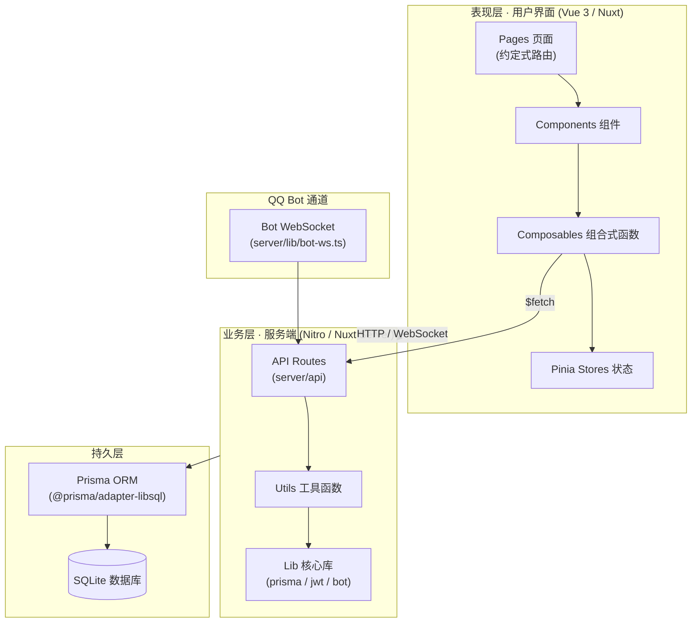
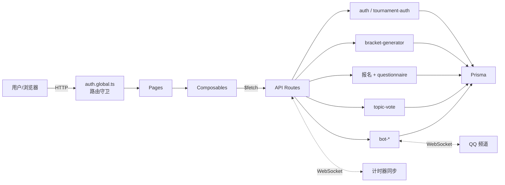
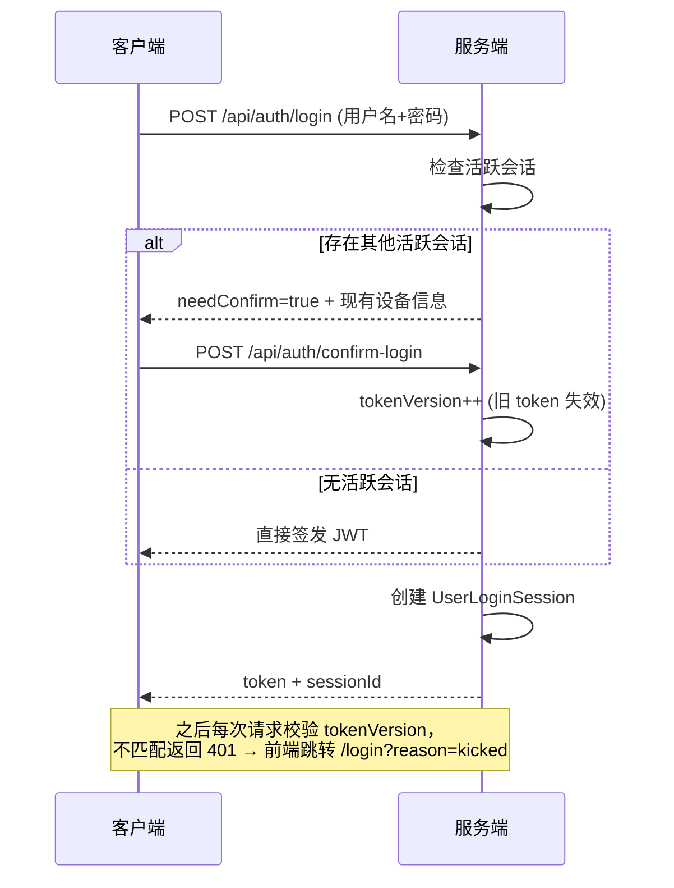
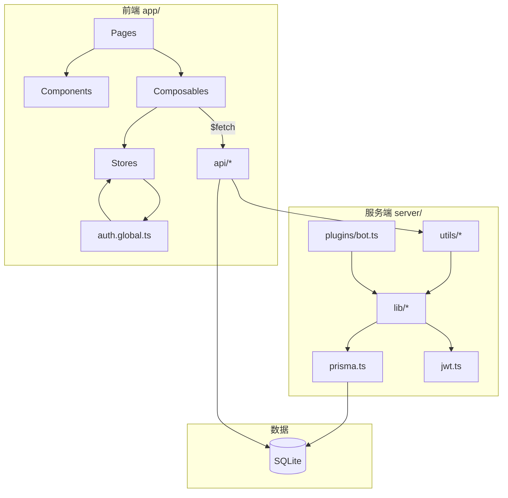
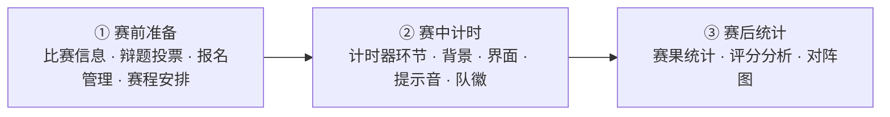

# DebateTimer V3 — Code Wiki（结构化技术文档）

> 辩论赛计时与评分管理系统 · 全栈技术参考
> 文档版本：V3.3（增强版） · 生成日期：2026-07-07
> 面向新成员：阅读本文可在 30 分钟内建立项目全局认知，并定位任一模块的代码入口。

---

## 目录

1. [项目概述](#1-项目概述)
2. [项目整体架构](#2-项目整体架构)
3. [主要模块职责](#3-主要模块职责)
4. [关键类与函数说明](#4-关键类与函数说明)
5. [依赖关系](#5-依赖关系)
6. [项目运行方式](#6-项目运行方式)
7. [附录：API 速览与工程约定](#7-附录api-速览与工程约定)

---

## 1. 项目概述

### 1.1 定位
DebateTimer V3 是一套基于 **Nuxt 4 + Vue 3 + TypeScript + Prisma + SQLite** 的全栈辩论赛计时评分系统。它把「赛事管理 → 赛中计时 → 赛后统计」的完整生命周期搬到同一套 Web 应用中，并额外集成 QQ 频道 Bot、报名系统、辩题投票等扩展能力。

### 1.2 核心功能一览

| 能力域 | 关键特性 | 入口模块 |
|--------|----------|----------|
| 赛事管理 | 6 种赛制（单败/双败/循环/佩寄/瑞士/小组+淘汰）、手动/自动生成赛程、积分榜、软删除+恢复 | `server/utils/bracket-generator.ts`、`app/pages/tournaments/[id]/schedule.vue` |
| 实时计时 | 单/双计时器、WebSocket 多端同步、离线版导出 | `app/stores/debate.ts`、`app/components/TimerPreview.vue` |
| QQ Bot | 频道内身份认领、赛场管理、赛程/排名播报、权限控制 | `server/lib/bot-*.ts` |
| 报名系统 | 个人/队伍报名、免登录公开报名、自定义字段、自动组队、辩手子账号 | `app/composables/useRegistration.ts`、`server/api/tournaments/[id]/` |
| 辩题投票 | 赛前候选辩题库投票、多种投票者类型、防刷指纹 | `server/utils/topic-vote.ts` |
| 权限体系 | system_admin / admin / subaccount / debater / individual 五级，单设备登录 | `server/utils/auth.ts`、`server/utils/tournament-auth.ts` |

---

## 2. 项目整体架构

### 2.1 分层架构

系统采用经典的前后端一体（Nuxt 全栈）分层：表现层 = Vue 页面/组件；业务层 = Nitro 服务端 API；持久层 = Prisma + SQLite。QQ Bot 通过独立 WebSocket 通道与业务层交互。



### 2.2 技术选型概览

| 层级 | 技术 | 版本 | 说明 |
|------|------|------|------|
| 前端框架 | Nuxt / Vue | 4.4.8 / 3.5.35 | 约定式路由、SSR/SSG、自动导入 |
| UI 组件库 | Nuxt UI（基于 Tailwind CSS） | v4.8.2 | 原子化样式 + 组件库（reka-ui 底层） |
| 状态管理 | Pinia | 3.0.4 | 客户端全局状态（auth / debate） |
| 路由 | Vue Router | 5.1.0 | 随 Nuxt 约定式路由自动生成 |
| 图标 | @iconify-json/lucide | 1.2.x | Lucide 图标集（`i-lucide-*`） |
| 服务端 | Nitro（Nuxt Server） | 内置 | API Routes、OpenAPI、WebSocket |
| ORM | Prisma | 7.8.0 | Schema 在 `prisma/schema.prisma`，生成到 `server/lib/generated` |
| 数据库 | SQLite（libsql 适配器） | — | 通过 `@libsql/client` + `@prisma/adapter-libsql` 访问 |
| 认证 | JWT + bcryptjs | 9.0.3 / 3.0.3 | `jsonwebtoken` 签发，`bcryptjs` 校验密码 |
| 实时通信 | WebSocket（ws 库） | 8.21.0 | 计时器同步 + QQ Bot 网关 |
| 文档生成 | docx | 9.7.1 | 导出 Word 版报名/对阵等材料 |
| 拖拽 | vue-draggable-plus | 0.6.1 | 问卷设计器、环节排序 |

### 2.3 目录结构

```
DebateTimerV3/
├── app/                         # 前端应用（Nuxt 约定式路由根目录）
│   ├── layouts/                 # 布局：default / tournament / standalone
│   ├── pages/                   # 页面路由（文件即路由）
│   │   ├── tournaments/[id]/    # 赛事各子页面（info/schedule/timing/...）
│   │   ├── standalone/[id]/     # 独立赛事各子页面
│   │   ├── timer/               # 计时器项目
│   │   ├── bot/                 # Bot 管理
│   │   └── teams/               # 团队管理
│   ├── components/              # 通用组件（BracketView / TimerPreview / FormDesigner ...）
│   ├── composables/             # 组合式函数（useAuth / useTournament / useRegistration ...）
│   ├── stores/                  # Pinia 状态（auth / debate）
│   ├── middleware/              # 路由守卫（auth.global.ts）
│   ├── plugins/                 # 插件（auth 初始化、fetch 拦截器）
│   └── assets/css/              # 全局样式（main.css，含 CSS 变量主题）
├── server/                      # 后端服务（Nitro）
│   ├── api/                     # REST API 路由（按资源分目录）
│   ├── lib/                     # 核心库（prisma / jwt / bot-* / generated）
│   ├── utils/                   # 工具函数（auth / bracket-generator / questionnaire ...）
│   ├── db/                      # 种子脚本（seed.ts）
│   └── plugins/                 # 服务端插件（Bot 启动）
├── prisma/                      # Prisma Schema + 本地数据库文件
├── public/                      # 静态资源（字体 woff2 / 音频 mp3 / 图标）
├── nuxt.config.ts               # Nuxt 全局配置（构建/缓存/路由规则）
├── package.json                 # 依赖与脚本
└── reference/                   # 历史参考文档
```

---

## 3. 主要模块职责

### 3.1 模块总览

| 模块 | 代码位置 | 功能边界 | 主要依赖 |
|------|----------|----------|----------|
| 权限认证 | `server/utils/auth.ts`、`tournament-auth.ts`、`server/lib/jwt.ts` | JWT 签发校验、角色判定、单设备登录、赛事读写分离 | prisma、bcryptjs、jsonwebtoken |
| 赛事与赛程 | `server/utils/bracket-generator.ts`、`server/api/tournaments/` | 赛事 CRUD、6 赛制生成、晋级联动、抽签、积分榜 | prisma、auth |
| QQ Bot | `server/lib/bot-*.ts`、`server/api/bot/` | WebSocket 连接、消息处理、身份/权限、赛场管理、播报 | ws、prisma、http |
| 计时器引擎 | `app/stores/debate.ts`、`app/components/TimerPreview.vue`、`TimerConfig.vue` | 单/双计时器状态机、实时预览、环节切换 | Pinia、WebSocket |
| 报名系统 | `app/composables/useRegistration.ts`、`server/api/tournaments/[id]/` | 报名提交/审核、自定义字段、自动组队、子账号 | questionnaire、auth |
| 通用问卷 | `server/utils/questionnaire.ts`、`app/components/FormDesigner.vue` | 报名/投票/签到统一题目引擎（12 题型） | prisma |
| 辩题投票 | `server/utils/topic-vote.ts`、`server/api/tournaments/[id]/topic-votes` | 候选辩题投票、统计、防刷 | prisma、questionnaire |
| 前端导航 | `app/layouts/*`、`app/middleware/auth.global.ts` | 侧边栏、赛事三阶段流程导航、路由守卫 | stores/auth |

### 3.2 模块交互关系



### 3.3 逐模块说明

#### 3.3.1 权限认证模块
- **职责边界**：所有需要身份/权限判定的逻辑收敛于此，API 层不重复实现。
- **核心能力**：从请求头提取用户、校验单设备登录（tokenVersion）、角色权限判定、赛事级读写分离。
- **与其他模块交互**：`tournament-auth.ts` 依赖 `auth.ts` 与 `prisma`；业务 API 通过 `requireReadTournament` / `requireWriteTournament` 直接复用。

#### 3.3.2 赛事与赛程模块
- **职责边界**：赛制算法与赛事数据生命周期，不直接处理 UI。
- **核心能力**：6 种赛制生成、种子保护、BYE 识别、胜者晋级溯源（promotedFromA/B）、乐观锁并发、瑞士轮动态重配对、小组晋级、抽签（分组/辩题/正反方）、积分榜计算。
- **与其他模块交互**：生成/晋级结果写入 `Match`；结果提交触发 `advanceWinnerToNextRound`；积分榜由 `computeStandings` 实时计算。

#### 3.3.3 QQ Bot 模块
- **职责边界**：与 QQ 频道网关的实时交互，独立于核心业务。
- **核心能力**：WebSocket 连接管理（心跳/指数退避重连/熔断）、多团队错峰启动、赛场管理、消息命令分发、身份认领、环节权限控制、计分与播报。
- **与其他模块交互**：通过 HTTP API 读写 `BotArena` / `BotArenaClaim` 等表；内部调用赛程/排名查询同步到频道。

#### 3.3.4 计时器引擎模块
- **职责边界**：纯前端状态机 + 服务端运行时状态持久化。
- **核心能力**：单/双计时器倒计时、阶段（警告/危急）提示音、环节切换、双计时器独立重置、16:9 实时预览。
- **与其他模块交互**：`TimerPreview` 复刻正式计时器视觉效果；运行时状态落 `Timer` 表；通过 WebSocket 多端同步。

#### 3.3.5 报名系统模块
- **职责边界**：报名全流程 + 与问卷引擎、子账号创建的协作。
- **核心能力**：个人/队伍报名、免登录公开报名、自定义字段、审核流转、个人报名自动组队、批量生成 debater 子账号。
- **与其他模块交互**：报名字段同步到 `Questionnaire`；审核通过后 `convert-teams` 生成 `TournamentTeam`；`create-accounts` 生成 `User`（role=debater）。

#### 3.3.6 通用问卷 / 辩题投票模块
- **职责边界**：底层题目引擎 + 上层投票业务。
- **核心能力**：12 种题型、拖拽式表单设计器、题目与提交记录统一存储；辩题投票支持赛事级/场次级、多投票者类型、IP+UA 指纹防刷。

---

## 4. 关键类与函数说明

### 4.1 权限认证

#### `JWTPayload`（接口，`server/lib/jwt.ts`）
| 字段 | 类型 | 说明 |
|------|------|------|
| `userId` | string | 用户 ID |
| `username` | string | 用户名 |
| `role` | string | system_admin / admin / subaccount / debater / individual |
| `mode` | string | qq_bot / individual |
| `teamId` | string? | 所属团队 |
| `tokenVersion` | number | 单设备登录版本号 |
| `sessionId` | string | 会话 ID |

#### 单设备登录流程


#### 赛事权限判定（`server/utils/tournament-auth.ts`）
```typescript
// 读权限：system_admin 或 同团队的 admin/subaccount/debater
canReadTournament(user, tournament): boolean
requireReadTournament(event, prisma, tournamentId): { user, tournament }

// 写权限：system_admin 或 团队 admin（adminId 匹配）
canWriteTournament(user, tournament, team): boolean
requireWriteTournament(event, prisma, tournamentId): { user, tournament }
```

### 4.2 赛程生成（`server/utils/bracket-generator.ts`）

| 函数 | 入参 | 返回 | 业务要点 |
|------|------|------|----------|
| `generateBracket(options)` | `{ teams, format, seedMode, ... }` | `{ matches, format, totalMatches, roundCount, formatLabel }` | 6 赛制总入口 |
| `generateSingleElimination(teams, opts)` | 队伍列表、种子方式 | `MatchInput[]` | 种子保护对阵 |
| `generateDoubleElimination(teams, opts)` | 同上 | `MatchInput[]` | 胜者组+败者组+复活决赛 |
| `generateRoundRobin(teams, opts)` | 同上 | `MatchInput[]` | Circle Method 单/双循环 |
| `generateSwiss(teams, opts)` | 同上 | `MatchInput[]` | 积分动态配对、避免重复 |
| `generateGroupKnockout(teams, opts)` | 分组数、每组晋级数 | `{ groupMatches, knockoutMatches }` | 蛇形分组 + 循环 + 淘汰 |
| `advanceWinnerToNextRound(tournamentId, finishedMatch)` | 赛事 ID、已结束比赛 | `AdvanceResult` | 胜者自动填入下一轮（promotedFrom 溯源） |
| `computeStandings(matches)` | 比赛列表 | `StandingsEntry[]` | 积分/胜平负/净胜分排序 |

**种子保护对阵算法**（`generateSeedingBracket`）：对 2 的幂队伍数，按 `(1 vs N), (2 vs N-1)...` 分布，确保强队晚相遇；`bracketSize=8 → [1,8,4,5,2,7,3,6]`。

**循环赛 Circle Method**：固定一支队伍，其余每轮旋转。例（5 队）：
```
第1轮: 1-5  2-4  3-轮空
第2轮: 1-4  5-3  2-轮空
第3轮: 1-3  4-2  5-轮空
第4轮: 1-2  3-5  4-轮空
第5轮: 1-轮空 2-5 3-4
```

### 4.3 QQ Bot（`server/lib/bot-*.ts`）

| 接口/函数 | 说明 |
|-----------|------|
| `BotConfig` | `{ appId, appSecret, teamId, teamName, channelId?, intents?, sandbox? }` |
| `BotInstance` | 运行时 Bot 对象：`ws`、`status`、`sendMessage/sendGroupMessage/sendPrivateMessage`、`retryCount` 等 |
| `getBackoffMs(retryCount, rateLimited)` | 指数退避重连：`5s→10s→20s→40s→80s→120s`（封顶），含 0–3s 抖动 |
| 多团队调度 | `bot-manager.ts` 控制错峰启动（3–5s 随机抖动）、健康巡检、资源快照 |

### 4.4 报名系统核心算法（`server/api/tournaments/[id]/` + `useRegistration`）

**个人报名自动组队**：按 `preferredPosition`（一辩/二辩/三辩/四辩/不限）分组 → 每组抽一人成队 → 「不限」补位 → 不足 `teamSize` 标记不完整。

**辩手子账号生成规则**：
- 用户名：`debater_{姓名}_{4位随机码}`（例 `debater_张三_myVO`）
- 密码：8 位随机字母数字
- 角色：`debater`（只读），`teamId` 关联赛事所属团队

### 4.5 计时器引擎（`app/stores/debate.ts` + `TimerPreview.vue`）

| 组成 | 说明 |
|------|------|
| `useDebateStore`（Pinia） | 维护剩余时长、运行态、当前环节索引、正/反方双计时状态 |
| `TimerPreview` | 1280×720 基准画布 + `transform: scale` 自适应；复刻正式计时器视觉，移除控制模块 |
| 计时阶段 | 警告（剩余 20%–10%）、危急（<10%）、提示音（30s/5s/0s） |

---

## 5. 依赖关系

### 5.1 内部模块依赖图



**依赖方向原则**：`pages → composables → stores/api`；`api → utils → lib → prisma`；禁止反向依赖（前端不直接 import `server/lib`）。

### 5.2 外部第三方库清单

| 库 | 版本 | 用途 | 引入位置 |
|----|------|------|----------|
| `@nuxt/ui` | ^4.8.2 | UI 组件库（Tailwind 之上） | `nuxt.config.ts` modules |
| `@pinia/nuxt` | ^0.11.3 | Pinia 集成 | `nuxt.config.ts` modules |
| `pinia` | ^3.0.4 | 状态管理 | 运行时依赖 |
| `vue` | ^3.5.35 | 前端框架 | 运行时依赖 |
| `vue-router` | ^5.1.0 | 路由 | 随 Nuxt |
| `@prisma/client` | ^7.8.0 | ORM 客户端 | `server/lib/prisma.ts` |
| `@prisma/adapter-libsql` | ^7.8.0 | SQLite/libsql 适配器 | `server/lib/prisma.ts` |
| `@libsql/client` | ^0.17.3 | libsql 驱动 | 适配器依赖 |
| `jsonwebtoken` | ^9.0.3 | JWT 签发/校验 | `server/lib/jwt.ts` |
| `bcryptjs` | ^3.0.3 | 密码哈希 | `server/utils/auth.ts` |
| `ws` | ^8.21.0 | WebSocket（Bot + 计时器） | `server/lib/bot-ws.ts` |
| `docx` | ^9.7.1 | 导出 Word 文档 | 报名/对阵导出 |
| `vue-draggable-plus` | ^0.6.1 | 拖拽排序 | `FormDesigner.vue` 等 |
| `@iconify-json/lucide` | ^1.2.112 | 图标集 | 构建依赖 |

---

## 6. 项目运行方式

### 6.1 环境要求

| 项目 | 要求 | 备注 |
|------|------|------|
| Node.js | 18+（推荐 20+ 以兼容 Nuxt 4） | 无 `engines` 强制，但 Nuxt 4 推荐 20 |
| 包管理器 | npm / pnpm / yarn | 文档示例用 npm |
| 操作系统 | Windows 10/11（开发验证环境） | `devServer.host` 设为 `localhost` 规避 Windows 升级错误 |
| 数据库 | 本地 SQLite 文件 | 无需独立数据库服务 |

### 6.2 安装与初始化

```bash
# 1. 安装依赖
npm install

# 2. 生成 Prisma Client（输出到 server/lib/generated）
npx prisma generate

# 3. 应用数据库 Schema（开发环境直接 push）
npx prisma db push

# 4. （可选）写入种子数据（初始账号）
npx tsx server/db/seed.ts
```

### 6.3 环境变量（`.env`）

| 变量 | 说明 | 示例 |
|------|------|------|
| `JWT_SECRET` | JWT 签名密钥（生产环境 ≥32 字符） | `your-production-secret-key` |
| `BOT_SANDBOX` | Bot 沙箱/正式环境切换 | `true`（开发）/ `false`（生产） |
| `DATABASE_URL` | 数据库文件路径 | `file:./dev.db` |
| `INTERNAL_API_KEY` | 内部接口鉴权密钥 | 生产环境必填 |

### 6.4 启动命令

| 命令 | 作用 |
|------|------|
| `npm run dev` | 启动开发服务器（默认端口 3000，访问 http://localhost:3000） |
| `npm run build` | 生产构建（输出 `.output/`） |
| `npm run preview` | 本地预览生产构建 |
| `node .output/server/index.mjs` | 直接启动生产服务（可用 PM2 托管） |
| `npx prisma studio` | 数据库可视化 GUI |

> 开发启动前会自动检查 3000 端口是否已占用，避免重复起服务。

### 6.5 默认账号（种子数据）

| 角色 | 用户名 | 密码 |
|------|--------|------|
| 系统管理员 | admin | admin123 |
| 团队管理员 | teamadmin | team123 |

### 6.6 常见问题排查

| 问题 | 可能原因 | 解决 |
|------|----------|------|
| 启动报 `Upgrade Required` / Vite entry 404 | Windows 下 devServer host 配置 | 确认 `nuxt.config.ts` 中 `devServer.host='localhost'` |
| 子页面切换需刷新才能进入 | 页面/布局过渡 + View Transition 叠加 | 已全局关闭 `pageTransition`/`layoutTransition`/`viewTransition` |
| 字体加载超时导致构建失败 | 外部字体 API 不可达 | 已禁用 `@nuxt/fonts` 外部 provider，仅用本地 woff2 |
| 计时器预览比例异常 | 画布 `transform: scale` 计算偏差 | `TimerPreview` 以 1280×720 为基准动态缩放 |
| 单设备登录被踢 | 其他设备确认登录致 `tokenVersion++` | 重新登录；管理会话见 `UserLoginSession` |
| Bot 连接频繁断开 | Intents 不匹配 / 网络抖动 | 查看 `BotPermissionLog`；重连采用指数退避（封顶 120s） |

---

## 7. 附录：API 速览与工程约定

### 7.1 RESTful API 结构

| 模块 | 路径前缀 | 主要功能 |
|------|----------|----------|
| 认证 | `/api/auth/` | 登录、登出、改密、多设备确认 |
| 赛事 | `/api/tournaments/` | 赛事 CRUD、赛程、报名、计时器、投票 |
| 比赛 | `/api/matches/` | 单场 CRUD、结果提交、软删除恢复 |
| 团队 | `/api/teams/` | 团队/成员管理、赛事列表 |
| Bot | `/api/bot/` | Bot 配置、赛场、权限、WebSocket |
| 管理员 | `/api/admin/` | 用户/团队管理、密码重置 |
| 内部 | `/api/internal/` | 计时器内部调用（赛程/排名/环节） |
| 计时器 | `/api/timer/` | 计时器项目 CRUD |
| 独立比赛 | `/api/standalone-matches/` | 独立比赛管理 |

### 7.2 赛事三阶段页面导航（流程式）

赛事详情布局 `app/layouts/tournament.vue` 以 **线性流程** 组织功能模块，点击任意阶段节点可自由跳转，无需按序操作：



### 7.3 工程硬约束

1. 赛事 ID 为 8 位字母数字字符串（大小写不敏感）。
2. 中间件全部 `async/await`，禁止 callback 风格。
3. 仅使用 **WOFF2** 字体，存放于 `public/fonts/`。
4. 单设备登录：新设备登录需确认后踢掉旧设备（`tokenVersion` 机制）。
5. 配置页统一架构：左侧 16:9 实时预览（约 1/3），右侧配置（约 2/3）。
6. 赛程配置弹窗仅保留 6 字段（日期/地点/正反队名/正反辩题）。
7. 敏感文件（SQLite/.env/私钥）通过 `.gitignore` 排除。

### 7.4 前端约定

- 路由守卫：`app/middleware/auth.global.ts` 放行 `/login`、`/`、`/tournaments/[id]/register`、`/tournaments/[id]/topic-vote`。
- 状态存储：Cookie（`auth_token`/`auth_user`，SSR 读取）+ localStorage（兜底）+ Pinia（运行时）。
- 级联/下拉选择器使用 `<Teleport to="body">` + `position: fixed` 避免被 `overflow:hidden` 截断。
- 日期选择使用原生 `<input type="datetime-local">`（Nuxt UI v4 无 UDatePicker）。

---

*文档维护：本 Wiki 随代码迭代更新，如发现与实现不符请以代码为准，并同步修订此处。*
