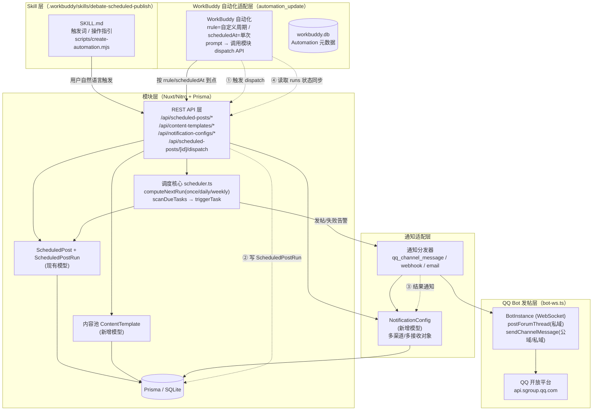
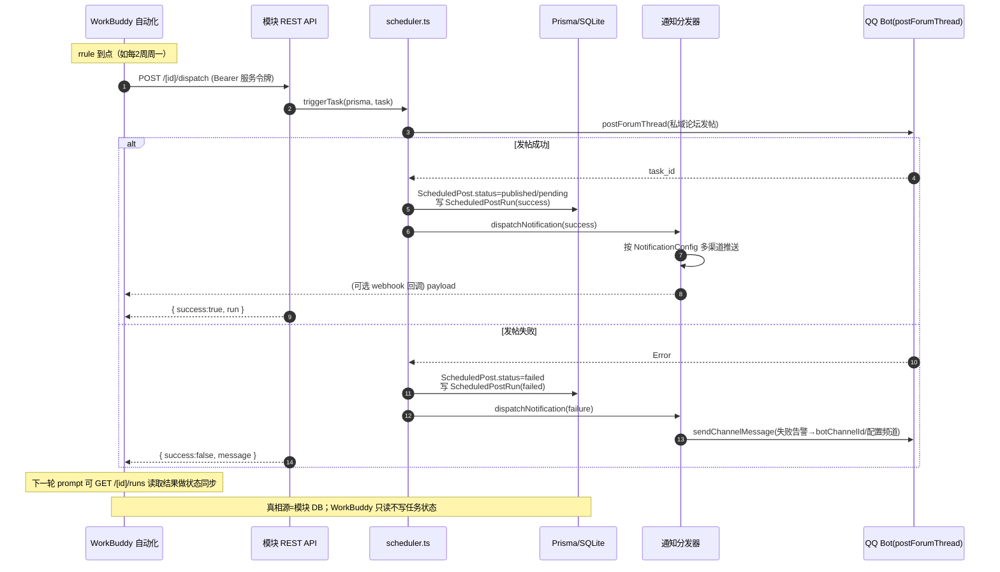

# 定时发布模块 · 可复用 Skill 封装与 WorkBuddy 自动化集成架构设计

> 适用范围：DebateTimerV3（Nuxt 4 + Vue 3.5 + Pinia + Nitro + Prisma/SQLite）
> 本文档为**纯架构设计**，不改动任何现有源码。所有接口、模型、路由均基于现有实现事实推导。
> 设计日期：2026-07-14

---

## 0. 现有实现事实摘要（设计依据）

| 来源                             | 关键事实                                                                                                                                                                                                                                                                                                                                                                                                                   |
| -------------------------------- | -------------------------------------------------------------------------------------------------------------------------------------------------------------------------------------------------------------------------------------------------------------------------------------------------------------------------------------------------------------------------------------------------------------------------- |
| `server/lib/scheduler.ts`        | `computeNextRun` 仅支持 `once`/`daily`/`weekly`，**无 cron**；`scanDueTasks(prisma)` 扫描 `status='pending' && nextRunAt<=now` → 调 `triggerTask` 发帖 → 写 `ScheduledPostRun`；失败时置 `failed`+`sendChannelMessage` 推到 `Team.botChannelId`；`startScheduler/stopScheduler` 为 **in-process 30s 扫描**，与 Bot 保活同生命周期（serverless scale-to-zero 下需外部 ping 唤醒）。                                         |
| `server/lib/bot-ws.ts`           | `BotConfig` 类型；`postForumThread(config,channelId,title,content,format)`（**仅私域**）；`sendChannelMessage(config,channelId,content)`（公域/私域均可用）；`PRIVATE_INTENTS`/`PUBLIC_INTENTS`、`resolveIntents(isPrivate)` 严格域隔离。                                                                                                                                                                                  |
| `prisma/schema.prisma`           | `ScheduledPost`（teamId,title,content,type,channelId,tags,pollOptions,scheduleType,runAt,timeHHMM,weekday,timezone,status,lastRunAt,lastResult,nextRunAt…）；`ScheduledPostRun`（scheduledPostId,runAt,status,message,postTaskId）；`Team`（含 `botAppId`/`botAppSecret`/`botChannelId`/`botIsPrivate`）。**无内容池模型**。                                                                                               |
| `server/api/scheduled-posts*.ts` | 6 条路由：GET/POST 列表与创建、PUT/DELETE `[id]`、POST `[id]/toggle`、GET `[id]/runs`。鉴权：`getUserFromEventWithSession`（admin/system_admin 可写，token 在 `Authorization: Bearer`）。                                                                                                                                                                                                                                  |
| `app/pages/bot/scheduled.vue`    | 管理页：类型(辩论题目/讨论话题)、标题、正文(MD)、目标论坛子频道 ID、标签、时区、投票选项、调度(单次/每天/每周)、星期；状态徽章 pending/published/paused/failed；启停/编辑/删除/历史。                                                                                                                                                                                                                                      |
| `server/plugins/bot.ts`          | 启动即从 DB `loadBotsFromDatabase`；每 5 分钟 `resyncConfiguredBots` 保活；`startScheduler(prismaInstance)` 启动调度；`close` 钩子清理。                                                                                                                                                                                                                                                                                   |
| WorkBuddy 平台                   | `automation_update` 管理自动化（存 `~/.workbuddy/workbuddy.db`）；`scheduleType`=`once`/`recurring`；`rrule`（RFC 5545，DAILY/HOURLY/WEEKLY/MONTHLY/YEARLY，可表达每 2 周、每月 15 号等自定义周期）；`scheduledAt`（仅 once）；`cwds`（逗号分隔工作目录）；`status`=ACTIVE/PAUSED；`validFrom/validUntil`；`prompt` 为 LLM 任务描述。Skill 为目录 + `SKILL.md`（frontmatter：name/description/触发词），分用户级与项目级。 |

---

## 1. 整体架构图



**分层职责一句话**：

- **Skill 层**：面向用户的自然语言入口，把"设个定时发布/建个内容池模板/挂个自动化"翻译成对模块 API 的调用，或一键创建 WorkBuddy 自动化。
- **模块层**：一切真相源。负责数据存储、发帖执行、失败重试、可靠调度（once/daily/weekly）。
- **WorkBuddy 自动化适配层**：负责**模块尚不支持的自定义周期**（rrule 能表达、原生调度器算不了），用自动化作为"上层编排触发器"。
- **通知适配层**：把"发布成功/失败"分发到可配置的多渠道、多接收对象。
- **QQ Bot 发帖层**：最终落到 QQ 开放平台，严格遵循私域/公域隔离。

---

## 2. 核心接口定义

### 2.1 (a) Skill 触发接口（SKILL.md 骨架 + 调用约定）

**目录结构**（项目级，跟随仓库走）：

```
.workbuddy/skills/debate-scheduled-publish/
├── SKILL.md                 # 主入口（frontmatter + 操作指引）
├── scripts/
│   └── create-automation.mjs   # 辅助：用 CLI 创建一条 WorkBuddy 自动化
└── references/
    └── api-contract.md      # 模块 REST API 契约（指向 §2.5）
```

**`SKILL.md` 骨架**：

```markdown
---
name: debate-scheduled-publish
description: 管理辩论赛「定时发布」——创建/编辑辩论题目与讨论帖的定时 QQ 论坛发帖、维护内容池模板、配置 WorkBuddy 自动化周期触发与多渠道通知。
triggers:
  - '定时发布'
  - '定时发帖'
  - '设置辩论题定时'
  - '每周自动发辩论题'
  - '内容池'
  - '自动发布辩论话题'
  - 'scheduled publish'
---

# 定时发布 Skill

你是 DebateTimer 定时发布助手。基于模块 REST API 工作（契约见 references/api-contract.md）。

## 能力

1. 内容池：列出/新建/编辑辩论题与讨论帖模板（含分类、标签、优先级）。
2. 定时任务：基于模板或自定义内容创建 ScheduledPost；支持 once/daily/weekly。
3. 自动化：当用户要求「每 N 周 / 每月 X 号」等**自定义周期**时，
   用 scripts/create-automation.mjs 创建一条 WorkBuddy 自动化，rrule 表达周期，
   prompt 内调用 POST /api/scheduled-posts/[id]/dispatch 触发发布。
4. 通知：配置 NotificationConfig（成功/失败都通知，指定频道或用户或 webhook）。

## 调用约定（必须）

- 所有写操作需管理员鉴权：请求头 `Authorization: Bearer <token>`。
- 自动化触发模块 API 使用**服务令牌**（非用户会话），见 api-contract.md 的「服务令牌」。
- 论坛发帖仅私域机器人可用；公域机器人创建任务时须提示用户改用消息频道或私域 Bot。
```

**调用约定（结构化）**：

| 项目       | 约定                                                                                                     |
| ---------- | -------------------------------------------------------------------------------------------------------- |
| 触发方式   | 用户消息命中 `triggers` 关键词 → WorkBuddy 加载本 Skill → LLM 读取 SKILL.md → 选择能力                   |
| 与模块通信 | 经 §2.5 的 REST API；Skill 本身**不实现**发帖逻辑，只编排                                                |
| 创建自动化 | 调 `scripts/create-automation.mjs`（封装 `automation_update`），传 `rrule`/`scheduledAt` + `prompt` 模板 |
| 鉴权       | 用户会话 `Bearer <sessionToken>`（管理页同款）；自动化触发用 `Bearer <serviceToken>`（见 §2.5 服务令牌） |

### 2.2 (b) ContentTemplate 内容池接口（新增模型）

**Prisma 模型（追加到 `schema.prisma`）**：

```prisma
// ════════════════════════════════════════════════════
// 内容池 — 辩论题目 / 讨论帖模板库（元数据 + 正文）
// 关系：模板 →（可多次）实例化为 ScheduledPost（复制内容，不硬绑定）
// ════════════════════════════════════════════════════
model ContentTemplate {
  id          String   @id @default(uuid())
  teamId      String
  category    String   @default("general") // 分类：debate / discussion / announcement / ...
  title       String   // 模板标题
  body        String   // Markdown 正文（发布时复制进 ScheduledPost.content）
  type        String   @default("discussion") // 'debate' | 'discussion'（同 ScheduledPost.type）
  tags        String?  // 逗号分隔
  pollOptions String?  // JSON 数组：["A队","B队"]
  priority    Int      @default(0)  // 优先级排序，越大越靠前
  usageCount  Int      @default(0)  // 被实例化为任务的次数
  lastUsedAt  DateTime?
  createdAt   DateTime @default(now())
  updatedAt   DateTime @updatedAt

  team Team @relation(fields: [teamId], references: [id], onDelete: Cascade)
  @@index([teamId])
  @@index([teamId, category])
  @@index([teamId, priority])
}
```

**TypeScript 视图类型**（供前端/API 复用）：

```ts
type ContentTemplateDTO = {
  id: string
  teamId: string
  category: string
  title: string
  body: string
  type: 'debate' | 'discussion'
  tags: string | null
  pollOptions: string[] | null // 反序列化后
  priority: number
  usageCount: number
  lastUsedAt: string | null
  createdAt: string
  updatedAt: string
}

// 创建/编辑入参
type ContentTemplateInput = {
  category?: string
  title: string
  body: string
  type?: 'debate' | 'discussion'
  tags?: string
  pollOptions?: string[]
  priority?: number
}
```

**与 `ScheduledPost` 的关系**：模板**不**与任务硬绑定。实例化时执行"复制"——`POST /api/content-templates/[id]/instantiate` 读取模板，写入一条新的 `ScheduledPost`（复制 title/body/type/tags/pollOptions），并把模板 `usageCount+1`、`lastUsedAt=now`。这样模板可改、可复用、可多次生成任务，互不污染。

### 2.3 (c) ScheduledPost 调度接口（含自定义周期的 rrule 表达）

**现有字段（事实）**：`scheduleType: 'once'|'daily'|'weekly'`、`runAt`、`timeHHMM`、`weekday`、`timezone`、`status`、`nextRunAt`。

**扩展设计：自定义周期（rrule）**

推荐：**保留原生 `scheduleType`（once/daily/weekly）作为"模块内可靠调度"通道；新增 `customRrule String?` 字段承载 WorkBuddy 自动化负责的自定义周期。两者是"谁来触发"的分工而非冲突**——当 `customRrule` 非空时，该任务的到点由 WorkBuddy 自动化经 `/dispatch` 触发，模块自身的 `scanDueTasks` 仍会兜底扫描，但主要驱动来自自动化。

```prisma
// 追加到 ScheduledPost
customRrule String?  // RFC 5545，如 "FREQ=WEEKLY;INTERVAL=2"、"FREQ=MONTHLY;BYMONTHDAY=15"
// 例：每月最后一天 "FREQ=MONTHLY;BYMONTHDAY=-1"；每 2 周 "FREQ=WEEKLY;INTERVAL=2"
```

**自定义周期 rrule ↔ WorkBuddy 自动化 对照**：

| 用户意图              | rrule                        | WorkBuddy scheduleType |
| --------------------- | ---------------------------- | ---------------------- |
| 每天 09:00            | `FREQ=DAILY`                 | recurring + rrule      |
| 每周一 09:00          | `FREQ=WEEKLY;BYDAY=MO`       | recurring + rrule      |
| 每 2 周               | `FREQ=WEEKLY;INTERVAL=2`     | recurring + rrule      |
| 每月 15 号            | `FREQ=MONTHLY;BYMONTHDAY=15` | recurring + rrule      |
| 每月最后一天          | `FREQ=MONTHLY;BYMONTHDAY=-1` | recurring + rrule      |
| 单次 2026-08-01 20:00 | —（不用 rrule）              | once + scheduledAt     |

> 注：模块自身 `computeNextRun` **不解析 rrule**（避免引入 cron 库，延续 ponytail 取舍）。rrule 的"下次触发计算"完全由 WorkBuddy 自动化的调度引擎承担，模块只接收"现在请发布这条任务"的 dispatch 指令。这正是最佳分工：**周期计算交给擅长它的 WorkBuddy，发帖与重试交给擅长它的模块**。

### 2.4 (d) NotificationConfig 通知接口（可配置多渠道/多接收对象）

**现有事实**：仅失败告警发到 `Team.botChannelId`（硬编码于 `scanDueTasks`）。新设计把通知抽象为可配置项。

```prisma
// ════════════════════════════════════════════════════
// 通知配置 — 按团队配置"何时、经哪个渠道、发给谁"
// ════════════════════════════════════════════════════
model NotificationConfig {
  id        String   @id @default(uuid())
  teamId    String   @unique   // 每团队一套配置
  // 触发事件：success(仅成功) | failure(仅失败) | both(都通知)
  onSuccess Boolean  @default(false)
  onFailure Boolean  @default(true)   // 兼容现有"失败才告警"默认行为
  // 渠道清单（JSON）：见下方 NotificationChannel
  channels  String   @default("[]")   // JSON 数组
  createdAt DateTime @default(now())
  updatedAt DateTime @updatedAt

  team Team @relation(fields: [teamId], references: [id], onDelete: Cascade)
}
```

**渠道与接收对象（TypeScript）**：

```ts
type NotificationChannel =
  | {
      type: 'qq_channel_message' // QQ 消息子频道（公域/私域均可，复用 sendChannelMessage）
      channelId: string // 可不同于 botChannelId，实现"多频道"
    }
  | {
      type: 'qq_forum_thread' // 论坛帖子（仅私域）；用于"成功也发一条摘要帖"
      channelId: string
      title?: string
    }
  | {
      type: 'webhook' // 通用回调（执行结果回调给外部系统/WorkBuddy 之外的服务）
      url: string
      secret?: string // 可选签名
    }
  | {
      type: 'email' // 邮件（需项目已有邮件能力；否则标记待实现）
      to: string[]
    }

type NotificationConfigDTO = {
  teamId: string
  onSuccess: boolean
  onFailure: boolean
  channels: NotificationChannel[]
}
```

**通知分发器伪代码**（新增 `server/lib/notify.ts`）：

```ts
// 在 scanDueTasks 成功/失败分支调用
export async function dispatchNotification(
  prisma,
  teamId: string,
  event: 'success' | 'failure',
  payload: { taskTitle: string; message: string; runAt: string },
) {
  const cfg = await prisma.notificationConfig.findUnique({ where: { teamId } })
  if (!cfg) return
  if (event === 'success' && !cfg.onSuccess) return
  if (event === 'failure' && !cfg.onFailure) return
  const channels: NotificationChannel[] = JSON.parse(cfg.channels || '[]')
  for (const ch of channels) {
    if (ch.type === 'qq_channel_message')
      await sendChannelMessage(cfg_as_botconfig, ch.channelId, buildText(payload))
    else if (ch.type === 'webhook')
      await fetch(ch.url, { method: 'POST', body: JSON.stringify(payload) })
    // ...
  }
}
```

> **关键决策**：通知的"真相源"仍是模块 DB（`ScheduledPostRun`）。WorkBuddy 自动化若需获知结果，既可由模块经 `webhook` 渠道**主动回调**，也可由自动化在下一轮 prompt 中 **GET `/runs` 主动拉取**（推荐后者，避免循环依赖）。见 §3.4。

### 2.5 (e) 模块对外 REST API 契约

**现有 6 条（归纳，均带 `Authorization: Bearer <sessionToken>`，写操作限 admin/system_admin）**：

| 方法   | 路径                               | 作用         | 关键入参                                                                                           |
| ------ | ---------------------------------- | ------------ | -------------------------------------------------------------------------------------------------- |
| GET    | `/api/scheduled-posts`             | 列本团队任务 | —                                                                                                  |
| POST   | `/api/scheduled-posts`             | 创建任务     | title,content,type,channelId,tags?,pollOptions?[],scheduleType,runAt?/timeHHMM?/weekday?/timezone? |
| PUT    | `/api/scheduled-posts/[id]`        | 编辑任务     | 同上可选；调度变更重算 nextRunAt                                                                   |
| DELETE | `/api/scheduled-posts/[id]`        | 删除任务     | —                                                                                                  |
| POST   | `/api/scheduled-posts/[id]/toggle` | 暂停/恢复    | `{ paused: boolean }`                                                                              |
| GET    | `/api/scheduled-posts/[id]/runs`   | 发布历史     | —                                                                                                  |

**新增路由（支撑内容池 / 通知 / WorkBuddy 集成）**：

| 方法   | 路径                                      | 作用                                           | 鉴权            | 关键入参/返回                                                                                 |
| ------ | ----------------------------------------- | ---------------------------------------------- | --------------- | --------------------------------------------------------------------------------------------- |
| GET    | `/api/content-templates`                  | 列模板（按 priority 排序）                     | session(本团队) | 返回 `ContentTemplateDTO[]`                                                                   |
| POST   | `/api/content-templates`                  | 新建模板                                       | session(admin)  | `ContentTemplateInput`                                                                        |
| PUT    | `/api/content-templates/[id]`             | 编辑模板                                       | session(admin)  | `ContentTemplateInput`(可选)                                                                  |
| DELETE | `/api/content-templates/[id]`             | 删除模板                                       | session(admin)  | —                                                                                             |
| POST   | `/api/content-templates/[id]/instantiate` | 模板→任务                                      | session(admin)  | `{ scheduleType, runAt?/timeHHMM?/weekday?/timezone?, channelId }` → 返回新建 `ScheduledPost` |
| GET    | `/api/notification-configs`               | 读取通知配置                                   | session(admin)  | 返回 `NotificationConfigDTO`                                                                  |
| PUT    | `/api/notification-configs`               | upsert 通知配置                                | session(admin)  | `NotificationConfigDTO`                                                                       |
| POST   | `/api/scheduled-posts/[id]/dispatch`      | **立即发布（WorkBuddy 触发入口）**             | **服务令牌**    | 返回 `{ success, run: ScheduledPostRun }`                                                     |
| POST   | `/api/scheduled-posts/dispatch-due`       | 扫描并发布所有到期（外部 cron/自动化保活入口） | **服务令牌**    | 返回 `{ triggered: number }`                                                                  |

**服务令牌（关键安全设计）**：

- 自动化 prompt 无法持有用户会话，因此新增一种**服务令牌**：团队级 `Team.apiToken`（新增字段，启动时 `crypto.randomUUID()` 生成或管理员在页面配置），随请求 `Authorization: Bearer <apiToken>`。
- 新增守卫 `requireServiceToken(event, prisma)`：仅对 `/dispatch`、`/dispatch-due` 生效；校验 `apiToken` 归属且团队 `mode='qq_bot'`。用户会话令牌**不**能调用这两个端点（最小权限）。
- 风险与缓解见 §5。

---

## 3. WorkBuddy 自动化集成方案

### 3.1 创建示例（automation_update）

**场景 A：自定义周期——每 2 周周一 09:00 发辩论题**

```json
{
  "name": "DebateTimer-每2周发辩论题",
  "scheduleType": "recurring",
  "rrule": "FREQ=WEEKLY;INTERVAL=2;BYDAY=MO",
  "status": "ACTIVE",
  "cwds": "D:/Code/DebateTimer/DebateTimerV3",
  "prompt": "请调用 DebateTimer 定时发布模块 API 立即发布指定任务。\n步骤：\n1. 用服务令牌 POST http://localhost:3000/api/scheduled-posts/<任务ID>/dispatch ，请求头 Authorization: Bearer <服务令牌>。\n2. 若返回 success=false，记录错误并在下次触发时重试（最多 3 次）。\n3. 不要自行计算时区或拼接发帖内容，那由模块负责。",
  "modelId": "hy3"
}
```

**场景 B：每月 15 号 20:00**

```json
{
  "name": "DebateTimer-每月15号发讨论帖",
  "scheduleType": "recurring",
  "rrule": "FREQ=MONTHLY;BYMONTHDAY=15",
  "status": "ACTIVE",
  "cwds": "D:/Code/DebateTimer/DebateTimerV3",
  "prompt": "POST /api/scheduled-posts/<任务ID>/dispatch （Bearer 服务令牌），发布失败则记录。"
}
```

**场景 C：单次（once + scheduledAt）**

```json
{
  "name": "DebateTimer-单次发布",
  "scheduleType": "once",
  "scheduledAt": "2026-08-01T20:00:00+08:00",
  "status": "ACTIVE",
  "prompt": "POST /api/scheduled-posts/<任务ID>/dispatch （Bearer 服务令牌）。"
}
```

> 每日/每周**也可**用自动化表达（`FREQ=DAILY` / `FREQ=WEEKLY;BYDAY=MO`），但**推荐**此类简单周期仍走模块原生 `daily/weekly` 调度（更准时、失败重试已在模块内闭环，不依赖 LLM 调度）。**自动化专攻 rrule 能表达、原生调度器算不了的周期**。

### 3.2 prompt 模板（让自动化去调用模块 API 发布到期任务）

```
你是一个定时任务执行器。请按以下步骤执行，不要发挥：

目标：触发 DebateTimer 模块发布一条已配置的定时任务。
1. 端点：POST {BASE_URL}/api/scheduled-posts/{TASK_ID}/dispatch
2. 请求头：Authorization: Bearer {SERVICE_TOKEN}
3. 若响应 success=true：结束，无需回复用户。
4. 若 success=false：记录 message，等待下个周期重试（模块自身也会重试，你只负责"触发"）。
5. 严禁：自行拼接帖子内容、自行计算时区、调用除 dispatch 之外的写接口。

说明：真正的发帖、失败告警、历史落库都由模块完成；你只是"到点按一下开关"。
```

### 3.3 状态同步机制（谁读谁、以什么为真相源）

| 维度             | 真相源（Source of Truth）                                                                    | 同步方向                                |
| ---------------- | -------------------------------------------------------------------------------------------- | --------------------------------------- |
| 任务是否发布成功 | 模块 `ScheduledPostRun`（SQLite）                                                            | WorkBuddy **读取**模块（被动/主动拉取） |
| 任务下次触发时间 | 模块 `ScheduledPost.nextRunAt`（once/daily/weekly）或 WorkBuddy 自动化 `rrule`（自定义周期） | 各自计算；自定义周期以 WorkBuddy 为准   |
| 通知结果         | 模块 `NotificationConfig` + `ScheduledPostRun.message`                                       | 模块**主动推送**（qq_channel/webhook）  |

- **状态同步**（WorkBuddy → 模块读）：自动化在 prompt 中可 `GET /api/scheduled-posts/[id]/runs` 拉取最新执行状态，用于日志/决定是否重试。**模块是真相源，WorkBuddy 只消费**。
- **执行结果回调**（模块 → 外部推）：模块 `dispatchNotification` 在成功/失败时，经 `webhook` 渠道把 `payload`（taskTitle/message/runAt）POST 给外部系统。这是"回调"的落点——**模块推，不是 WorkBuddy 拉**。

### 3.4 闭环时序图



**闭环要点**：

1. **触发**（WorkBuddy → 模块）：rrule 到点，自动化调 `/dispatch`。
2. **执行**（模块内）：`triggerTask` → QQ 发帖 → 写 `ScheduledPostRun` 历史。
3. **状态回写**（模块 → DB）：任务状态、上次结果、下次触发时间全部落在模块，WorkBuddy 不持有状态。
4. **结果通知/回调**（模块 → 外部）：`dispatchNotification` 按配置推多渠道；`webhook` 渠道即"执行结果回调"出口。
5. **状态同步**（WorkBuddy 拉取）：自动化下一轮可读 `/runs` 对齐状态——读，不写。

---

## 4. 文件清单与实现顺序建议

> 仅列出**新增/修改**，按依赖顺序；标注 [新] 为全新文件，[改] 为改动现有文件。

| 序  | 文件                                                                                                                  | 类型 | 依赖 | 说明                                                                                                   |
| --- | --------------------------------------------------------------------------------------------------------------------- | ---- | ---- | ------------------------------------------------------------------------------------------------------ |
| 1   | `prisma/schema.prisma`                                                                                                | [改] | —    | 新增 `ContentTemplate`、`NotificationConfig`；`ScheduledPost` 加 `customRrule?`；`Team` 加 `apiToken?` |
| 2   | `prisma/migrations/*`                                                                                                 | [新] | 1    | `prisma migrate dev` 生成迁移（SQLite 加列/新表）                                                      |
| 3   | `server/lib/notify.ts`                                                                                                | [新] | 1    | 通知分发器 `dispatchNotification`（多渠道/多接收对象）；供 scheduler 调用                              |
| 4   | `server/lib/scheduler.ts`                                                                                             | [改] | 3    | 在成功/失败分支调用 `dispatchNotification`；保持 `scanDueTasks` 兜底逻辑不变                           |
| 5   | `server/lib/auth.ts`（或现有 `utils/auth.ts`）                                                                        | [改] | 1    | 新增 `requireServiceToken(event, prisma)` 守卫（校验 `Team.apiToken`）                                 |
| 6   | `server/api/content-templates.get.ts` `...post.ts` `...[id].put.ts` `...[id].delete.ts` `...[id]/instantiate.post.ts` | [新] | 1    | 内容池 CRUD + 实例化                                                                                   |
| 7   | `server/api/notification-configs.get.ts` `...put.ts`                                                                  | [新] | 1,3  | 通知配置读取/upsert                                                                                    |
| 8   | `server/api/scheduled-posts/[id]/dispatch.post.ts` `.../dispatch-due.post.ts`                                         | [新] | 5    | WorkBuddy 触发入口（服务令牌鉴权，返回结果）                                                           |
| 9   | `app/pages/bot/scheduled.vue`                                                                                         | [改] | 6,7  | 增加"内容池"Tab、"通知设置"入口、模板→任务实例化按钮                                                   |
| 10  | `app/pages/bot/notification.vue` 或并入 `scheduled.vue`                                                               | [新] | 7    | 通知配置 UI（onSuccess/onFailure + 渠道列表编辑）                                                      |
| 11  | `.workbuddy/skills/debate-scheduled-publish/SKILL.md`                                                                 | [新] | 2-8  | Skill 主入口（§2.1）                                                                                   |
| 12  | `.workbuddy/skills/debate-scheduled-publish/scripts/create-automation.mjs`                                            | [新] | —    | 封装 `automation_update` 一键建自动化（传 rrule + prompt 模板）                                        |
| 13  | `.workbuddy/skills/debate-scheduled-publish/references/api-contract.md`                                               | [新] | 2-8  | 指向本设计 §2.5 的 API 契约简版                                                                        |

**实现顺序逻辑**：先数据模型(1-2) → 通知基础(3-4) → 鉴权(5) → 内容池/通知 API(6-7) → 自动化触发入口(8) → 前端(9-10) → Skill 封装(11-13)。前置不完成，后置无法联调。

---

## 5. 待明确事项 / 风险

| #   | 风险 / 待明确                                                                                                                                                  | 影响 | 建议 / 缓解                                                                                                                                                       |
| --- | -------------------------------------------------------------------------------------------------------------------------------------------------------------- | ---- | ----------------------------------------------------------------------------------------------------------------------------------------------------------------- |
| R1  | **serverless 缩容导致 in-process 调度器失效**：`startScheduler` 是进程内 setInterval，`scanDueTasks` 在 scale-to-zero 下不运行，once/daily/weekly 任务会漏发。 | 高   | 用外部定时器（WorkBuddy 自动化 `dispatch-due` / 平台 cron / uptime ping）按 30-60s 唤醒；或把调度器迁到外部 cron 服务。WorkBuddy 自动化本身也是"外部唤醒"的一种。 |
| R2  | **服务令牌鉴权**：自动化 prompt 无法持有用户会话，必须引入 `Team.apiToken`。令牌如何安全下发、轮换、撤销未定义。                                               | 高   | 在通知设置页提供"生成/重置服务令牌"；令牌哈希存储（非明文）；限定仅 `/dispatch*` 端点可用；可设 `validFrom/validUntil`。                                          |
| R3  | **WorkBuddy 自动化 prompt 调用私有 API 的可靠性**：prompt 是 LLM 任务，可能因模型行为偏差"忘记"调用、或调错参数（任务 ID、令牌）。                             | 中   | prompt 模板必须**极简、步骤化、禁发挥**；关键参数（TASK_ID/SERVICE_TOKEN）由 `scripts/create-automation.mjs` 注入而非让模型填；依赖模块自身的失败重试兜底。       |
| R4  | **rrule 与 nextRunAt 双真相源冲突**：自定义周期任务既有模块 `nextRunAt`（模块算）又有 WorkBuddy `rrule`（自动化算），二者可能不一致。                          | 中   | 约定：`customRrule` 非空时，**调度以 WorkBuddy 为准**，模块 `scanDueTasks` 仅作兜底（迟到也补发一次），不反向覆盖 rrule。                                         |
| R5  | **论坛发帖仅私域**：公域 Bot 调 `postForumThread` 必失败。自动化若对公域团队建任务会反复失败。                                                                 | 中   | Skill/UI 在建任务时检测 `Team.botIsPrivate`，公域则提示改用"消息频道通知"或切私域；自动化创建前做前置校验。                                                       |
| R6  | **webhook 回调的循环/超时**：`dispatchNotification` 同步 `fetch` 外部 webhook，若目标慢/宕机会拖慢发帖主流程。                                                 | 中   | 通知分发改为**异步**（`.catch` 吞错，不阻塞主流程，延续现有告警"失败不影响主流程"取舍）；webhook 加超时与重试上限。                                               |
| R7  | **多接收对象/邮件渠道**：`email` 渠道依赖项目是否已有邮件发送能力，当前代码未见。                                                                              | 低   | 本期 `email` 标记为"待实现"（接口预留），先落地 `qq_channel_message` + `webhook` 两类；`qq_forum_thread` 复用 `postForumThread`。                                 |
| R8  | **内容池与现有 Tournament.topicPool 关系**：`Tournament` 已有 `topicPool`（辩题库 JSON）。新 `ContentTemplate` 与之是否统一？                                  | 低   | 本期**不合并**：`topicPool` 服务于赛事抽签辩题，`ContentTemplate` 服务于定时论坛发帖，语义不同；后续可单向引用（模板来源含赛事辩题库）。                          |

---

## 6. 推荐的关键架构决策（摘要）

1. **双轨共存、各司其职**：模块原生调度器（`once/daily/weekly` + 失败重试）负责"可靠发帖"；WorkBuddy 自动化（`rrule`）专攻"自定义周期触发"。二者经 `POST /api/scheduled-posts/[id]/dispatch` 衔接——**周期计算交给 WorkBuddy，发帖与重试交给模块**，避免重复实现凭证管理与私域约束。
2. **真相源唯一在模块 DB**：任务状态/历史以 `ScheduledPostRun` 为准；WorkBuddy 只读（拉 `/runs`）不写；"执行结果回调"由模块经 `NotificationConfig.webhook` **主动推送**，避免循环依赖。
3. **内容池用"复制式实例化"**：`ContentTemplate` 不与任务硬绑定，实例化时复制内容，模板可改可复用。
4. **通知抽象为可配置多渠道**：保留"失败→botChannelId"默认行为，新增 `onSuccess/onFailure` + `channels[]`（qq_channel_message / webhook / forum / email），成功也可通知。
5. **安全用服务令牌隔离**：自动化触发走独立的 `Team.apiToken` 守卫，用户会话令牌不能调 `/dispatch*`，最小权限。
6. **Skill 只编排不实现**：`SKILL.md` 把用户自然语言翻译成对模块 API 的调用或一键创建自动化，发帖逻辑不进 Skill。

> 完整设计见本文档各节。实现顺序见 §4，风险与缓解见 §5。
